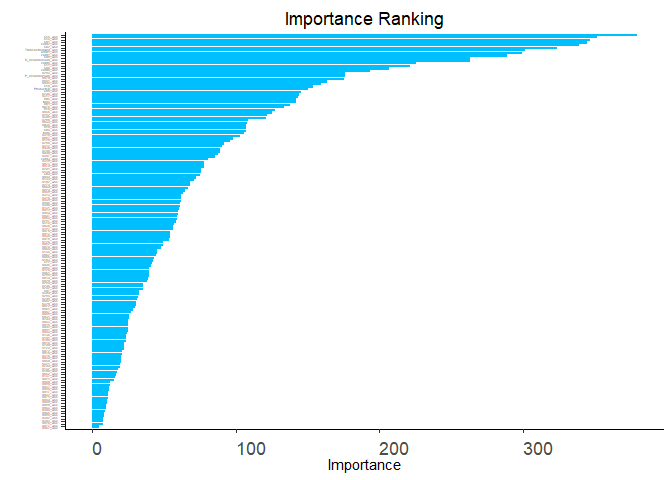
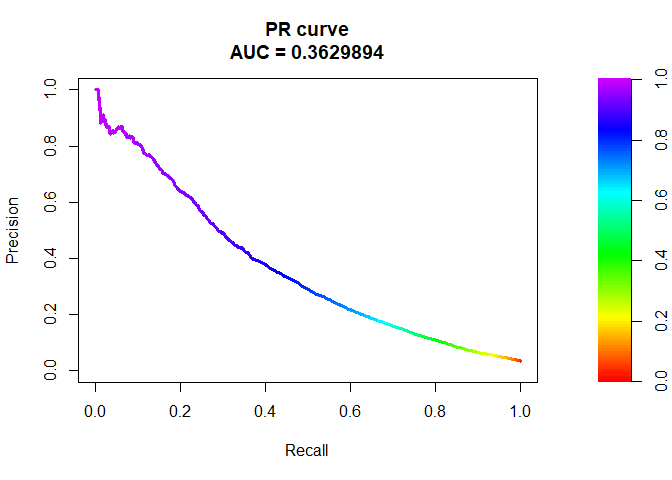

Parsimony
================
2024-04-21

## R Markdown

This is an R Markdown document. Markdown is a simple formatting syntax
for authoring HTML, PDF, and MS Word documents. For more details on
using R Markdown see <http://rmarkdown.rstudio.com>.

``` r
#summary(cars)
library(car)
library(scorecard)
library(stats) 
library(MASS) 
library ("plyr")
library(dplyr)
library(tidyr)
library(randomForestSRC)
library(caret)
library(purrr)
library(caret)
library(utils)
library(pROC)
library(AutoScore)
library(vctrs)
library(InformationValue)
library(pastecs)
library(openxlsx)
library(data.table)
library(PRROC)
library(glmnet)
library(reportRmd)
library(vimp)
library(scales)
library(ggplot2)
    
setwd("C:/Sue/PhD/CMP9701-DS/Code/AutoScore-Imbalance-main (1)/AutoScore-Imbalance-main/")
load("Train082123.Rdata") 

#descriptive statistics
ggplot(train_transaction, aes(y=TransactionAmt)) +  #x=Dose
  geom_boxplot(fill="gray")+
  labs(title="Plot of Transaction Amount (USD $)", y = "Transaction Amount (USD $)")+  #x="Dose (mg)",
  #theme_classic()+
  scale_y_continuous(label=dollar_format())+
  #scale_y_continuous(label=comma) +
  theme(axis.title.x=element_blank(),
        axis.text.x=element_blank(),
        axis.ticks.x=element_blank())
```

<!-- -->

``` r
#histogram
ggplot(train_transaction, aes(x=TransactionAmt, fill=isFraud)) +
  geom_histogram(fill="light blue", color="black")+
  geom_vline(aes(xintercept=mean(TransactionAmt)), color="blue",
             linetype="dashed")+
  labs(title="Transaction Amount histogram plot",x="Transaction Amount (USD $)", y = "Number of Transactions")+
  theme_classic()+
  scale_x_continuous(label=dollar_format())+
  scale_y_continuous(label=comma)
```

<!-- -->

``` r
#% missing
pctmissallcols <- colMeans(is.na(train_transaction))*100 
pctmissallcolsdf <- as.data.frame(pctmissallcols)
#add field names
pctmissallcolsdf$row_names <- row.names(pctmissallcolsdf)

pctmissallcolsdf
```

    ##                pctmissallcols      row_names
    ## TransactionID     0.000000000  TransactionID
    ## isFraud           0.000000000        isFraud
    ## TransactionDT     0.000000000  TransactionDT
    ## TransactionAmt    0.000000000 TransactionAmt
    ## ProductCD         0.000000000      ProductCD
    ## card1             0.000000000          card1
    ## card2             1.512683307          card2
    ## card3             0.265011684          card3
    ## card4             0.000000000          card4
    ## card5             0.721204321          card5
    ## card6             0.000000000          card6
    ## addr1            11.126426660          addr1
    ## addr2            11.126426660          addr2
    ## dist1            59.652352085          dist1
    ## dist2            93.628374031          dist2
    ## P_emaildomain     0.000000000  P_emaildomain
    ## R_emaildomain     0.000000000  R_emaildomain
    ## C01               0.000000000            C01
    ## C02               0.000000000            C02
    ## C03               0.000000000            C03
    ## C04               0.000000000            C04
    ## C05               0.000000000            C05
    ## C06               0.000000000            C06
    ## C07               0.000000000            C07
    ## C08               0.000000000            C08
    ## C09               0.000000000            C09
    ## C10               0.000000000            C10
    ## C11               0.000000000            C11
    ## C12               0.000000000            C12
    ## C13               0.000000000            C13
    ## C14               0.000000000            C14
    ## D01               0.214888069            D01
    ## D02              47.549192265            D02
    ## D03              44.514850815            D03
    ## D04              28.604666915            D04
    ## D05              52.467402716            D05
    ## D06              87.606766688            D06
    ## D07              93.409929895            D07
    ## D08              87.312290446            D08
    ## D09              87.312290446            D09
    ## D10              12.873302401            D10
    ## D11              47.293494090            D11
    ## D12              89.041047177            D12
    ## D13              89.509262709            D13
    ## D14              89.469468622            D14
    ## D15              15.090087039            D15
    ## M01              45.907135842            M01
    ## M02              45.907135842            M02
    ## M03              45.907135842            M03
    ## M04               0.000000000            M04
    ## M05              59.349409015            M05
    ## M06              28.678836319            M06
    ## M07              58.635316829            M07
    ## M08              58.633115454            M08
    ## M09              58.633115454            M09
    ## V001             47.293494090           V001
    ## V002             47.293494090           V002
    ## V003             47.293494090           V003
    ## V004             47.293494090           V004
    ## V005             47.293494090           V005
    ## V006             47.293494090           V006
    ## C007             47.293494090           C007
    ## V008             47.293494090           V008
    ## V009             47.293494090           V009
    ## V010             47.293494090           V010
    ## V011             47.293494090           V011
    ## V012             12.881938565           V012
    ## V013             12.881938565           V013
    ## V014             12.881938565           V014
    ## V015             12.881938565           V015
    ## V016             12.881938565           V016
    ## V017             12.881938565           V017
    ## V018             12.881938565           V018
    ## V019             12.881938565           V019
    ## V020             12.881938565           V020
    ## V021             12.881938565           V021
    ## V022             12.881938565           V022
    ## V023             12.881938565           V023
    ## V024             12.881938565           V024
    ## V025             12.881938565           V025
    ## V026             12.881938565           V026
    ## V027             12.881938565           V027
    ## V028             12.881938565           V028
    ## V029             12.881938565           V029
    ## V030             12.881938565           V030
    ## V031             12.881938565           V031
    ## V032             12.881938565           V032
    ## V033             12.881938565           V033
    ## V034             12.881938565           V034
    ## V035             28.612625732           V035
    ## V036             28.612625732           V036
    ## V037             28.612625732           V037
    ## V038             28.612625732           V038
    ## V039             28.612625732           V039
    ## V040             28.612625732           V040
    ## V041             28.612625732           V041
    ## V042             28.612625732           V042
    ## V043             28.612625732           V043
    ## V044             28.612625732           V044
    ## V045             28.612625732           V045
    ## V046             28.612625732           V046
    ## V047             28.612625732           V047
    ## V048             28.612625732           V048
    ## V049             28.612625732           V049
    ## V050             28.612625732           V050
    ## V051             28.612625732           V051
    ## V052             28.612625732           V052
    ## V053             13.055169845           V053
    ## V054             13.055169845           V054
    ## V055             13.055169845           V055
    ## V056             13.055169845           V056
    ## V057             13.055169845           V057
    ## V058             13.055169845           V058
    ## V059             13.055169845           V059
    ## V060             13.055169845           V060
    ## V061             13.055169845           V061
    ## V062             13.055169845           V062
    ## V063             13.055169845           V063
    ## V064             13.055169845           V064
    ## V065             13.055169845           V065
    ## V066             13.055169845           V066
    ## V067             13.055169845           V067
    ## V068             13.055169845           V068
    ## V069             13.055169845           V069
    ## V070             13.055169845           V070
    ## V071             13.055169845           V071
    ## V072             13.055169845           V072
    ## V073             13.055169845           V073
    ## V074             13.055169845           V074
    ## V075             15.098723202           V075
    ## V076             15.098723202           V076
    ## V077             15.098723202           V077
    ## V078             15.098723202           V078
    ## V079             15.098723202           V079
    ## V080             15.098723202           V080
    ## V081             15.098723202           V081
    ## V082             15.098723202           V082
    ## V083             15.098723202           V083
    ## V084             15.098723202           V084
    ## V085             15.098723202           V085
    ## V086             15.098723202           V086
    ## V087             15.098723202           V087
    ## V088             15.098723202           V088
    ## V089             15.098723202           V089
    ## V090             15.098723202           V090
    ## V091             15.098723202           V091
    ## V092             15.098723202           V092
    ## V093             15.098723202           V093
    ## V094             15.098723202           V094
    ## V095              0.053171673           V095
    ## V096              0.053171673           V096
    ## V097              0.053171673           V097
    ## V098              0.053171673           V098
    ## V099              0.053171673           V099
    ## V100              0.053171673           V100
    ## V101              0.053171673           V101
    ## V102              0.053171673           V102
    ## V103              0.053171673           V103
    ## V104              0.053171673           V104
    ## V105              0.053171673           V105
    ## V106              0.053171673           V106
    ## V107              0.053171673           V107
    ## V108              0.053171673           V108
    ## V109              0.053171673           V109
    ## V110              0.053171673           V110
    ## V111              0.053171673           V111
    ## V112              0.053171673           V112
    ## V113              0.053171673           V113
    ## V114              0.053171673           V114
    ## V115              0.053171673           V115
    ## V116              0.053171673           V116
    ## V117              0.053171673           V117
    ## V118              0.053171673           V118
    ## V119              0.053171673           V119
    ## V120              0.053171673           V120
    ## V121              0.053171673           V121
    ## V122              0.053171673           V122
    ## V123              0.053171673           V123
    ## V124              0.053171673           V124
    ## V125              0.053171673           V125
    ## V126              0.053171673           V126
    ## V127              0.053171673           V127
    ## V128              0.053171673           V128
    ## V129              0.053171673           V129
    ## V130              0.053171673           V130
    ## V131              0.053171673           V131
    ## V132              0.053171673           V132
    ## V133              0.053171673           V133
    ## V134              0.053171673           V134
    ## V135              0.053171673           V135
    ## V136              0.053171673           V136
    ## V137              0.053171673           V137
    ## V138             86.123717276           V138
    ## V139             86.123717276           V139
    ## V140             86.123717276           V140
    ## V141             86.123717276           V141
    ## V142             86.123717276           V142
    ## V143             86.122701256           V143
    ## V144             86.122701256           V144
    ## V145             86.122701256           V145
    ## V146             86.123717276           V146
    ## V147             86.123717276           V147
    ## V148             86.123717276           V148
    ## V149             86.123717276           V149
    ## V150             86.122701256           V150
    ## V151             86.122701256           V151
    ## V152             86.122701256           V152
    ## V153             86.123717276           V153
    ## V154             86.123717276           V154
    ## V155             86.123717276           V155
    ## V156             86.123717276           V156
    ## V157             86.123717276           V157
    ## V158             86.123717276           V158
    ## V159             86.122701256           V159
    ## V160             86.122701256           V160
    ## V161             86.123717276           V161
    ## V162             86.123717276           V162
    ## V163             86.123717276           V163
    ## V164             86.122701256           V164
    ## V165             86.122701256           V165
    ## V166             86.122701256           V166
    ## V167             76.355369662           V167
    ## V168             76.355369662           V168
    ## V169             76.323534392           V169
    ## V170             76.323534392           V170
    ## V171             76.323534392           V171
    ## V172             76.355369662           V172
    ## V173             76.355369662           V173
    ## V174             76.323534392           V174
    ## V175             76.323534392           V175
    ## V176             76.355369662           V176
    ## V177             76.355369662           V177
    ## V178             76.355369662           V178
    ## V179             76.355369662           V179
    ## V180             76.323534392           V180
    ## V181             76.355369662           V181
    ## V182             76.355369662           V182
    ## V183             76.355369662           V183
    ## V184             76.323534392           V184
    ## V185             76.323534392           V185
    ## V186             76.355369662           V186
    ## V187             76.355369662           V187
    ## V188             76.323534392           V188
    ## V189             76.323534392           V189
    ## V190             76.355369662           V190
    ## V191             76.355369662           V191
    ## V192             76.355369662           V192
    ## V193             76.355369662           V193
    ## V194             76.323534392           V194
    ## V195             76.323534392           V195
    ## V196             76.355369662           V196
    ## V197             76.323534392           V197
    ## V198             76.323534392           V198
    ## V199             76.355369662           V199
    ## V200             76.323534392           V200
    ## V201             76.323534392           V201
    ## V202             76.355369662           V202
    ## V203             76.355369662           V203
    ## V204             76.355369662           V204
    ## V205             76.355369662           V205
    ## V206             76.355369662           V206
    ## V207             76.355369662           V207
    ## V208             76.323534392           V208
    ## V209             76.323534392           V209
    ## V210             76.323534392           V210
    ## V211             76.355369662           V211
    ## V212             76.355369662           V212
    ## V213             76.355369662           V213
    ## V214             76.355369662           V214
    ## V215             76.355369662           V215
    ## V216             76.355369662           V216
    ## V217             77.913435161           V217
    ## V218             77.913435161           V218
    ## V219             77.913435161           V219
    ## V220             76.053103939           V220
    ## V221             76.053103939           V221
    ## V222             76.053103939           V222
    ## V223             77.913435161           V223
    ## V224             77.913435161           V224
    ## V225             77.913435161           V225
    ## V226             77.913435161           V226
    ## V227             76.053103939           V227
    ## V228             77.913435161           V228
    ## V229             77.913435161           V229
    ## V230             77.913435161           V230
    ## V231             77.913435161           V231
    ## V232             77.913435161           V232
    ## V233             77.913435161           V233
    ## V234             76.053103939           V234
    ## V235             77.913435161           V235
    ## V236             77.913435161           V236
    ## V237             77.913435161           V237
    ## V238             76.053103939           V238
    ## V239             76.053103939           V239
    ## V240             77.913435161           V240
    ## V241             77.913435161           V241
    ## V242             77.913435161           V242
    ## V243             77.913435161           V243
    ## V244             77.913435161           V244
    ## V245             76.053103939           V245
    ## V246             77.913435161           V246
    ## V247             77.913435161           V247
    ## V248             77.913435161           V248
    ## V249             77.913435161           V249
    ## V250             76.053103939           V250
    ## V251             76.053103939           V251
    ## V252             77.913435161           V252
    ## V253             77.913435161           V253
    ## V254             77.913435161           V254
    ## V255             76.053103939           V255
    ## V256             76.053103939           V256
    ## V257             77.913435161           V257
    ## V258             77.913435161           V258
    ## V259             76.053103939           V259
    ## V260             77.913435161           V260
    ## V261             77.913435161           V261
    ## V262             77.913435161           V262
    ## V263             77.913435161           V263
    ## V264             77.913435161           V264
    ## V265             77.913435161           V265
    ## V266             77.913435161           V266
    ## V267             77.913435161           V267
    ## V268             77.913435161           V268
    ## V269             77.913435161           V269
    ## V270             76.053103939           V270
    ## V271             76.053103939           V271
    ## V272             76.053103939           V272
    ## V273             77.913435161           V273
    ## V274             77.913435161           V274
    ## V275             77.913435161           V275
    ## V276             77.913435161           V276
    ## V277             77.913435161           V277
    ## V278             77.913435161           V278
    ## V279              0.002032038           V279
    ## V280              0.002032038           V280
    ## V281              0.214888069           V281
    ## V282              0.214888069           V282
    ## V283              0.214888069           V283
    ## V284              0.002032038           V284
    ## V285              0.002032038           V285
    ## V286              0.002032038           V286
    ## V287              0.002032038           V287
    ## V288              0.214888069           V288
    ## V289              0.214888069           V289
    ## V290              0.002032038           V290
    ## V291              0.002032038           V291
    ## V292              0.002032038           V292
    ## V293              0.002032038           V293
    ## V294              0.002032038           V294
    ## V295              0.002032038           V295
    ## V296              0.214888069           V296
    ## V297              0.002032038           V297
    ## V298              0.002032038           V298
    ## V299              0.002032038           V299
    ## V300              0.214888069           V300
    ## V301              0.214888069           V301
    ## V302              0.002032038           V302
    ## V303              0.002032038           V303
    ## V304              0.002032038           V304
    ## V305              0.002032038           V305
    ## V306              0.002032038           V306
    ## V307              0.002032038           V307
    ## V308              0.002032038           V308
    ## V309              0.002032038           V309
    ## V310              0.002032038           V310
    ## V311              0.002032038           V311
    ## V312              0.002032038           V312
    ## V313              0.214888069           V313
    ## V314              0.214888069           V314
    ## V315              0.214888069           V315
    ## V316              0.002032038           V316
    ## V317              0.002032038           V317
    ## V318              0.002032038           V318
    ## V319              0.002032038           V319
    ## V320              0.002032038           V320
    ## V321              0.002032038           V321
    ## V322             86.054966641           V322
    ## V323             86.054966641           V323
    ## V324             86.054966641           V324
    ## V325             86.054966641           V325
    ## V326             86.054966641           V326
    ## V327             86.054966641           V327
    ## V328             86.054966641           V328
    ## V329             86.054966641           V329
    ## V330             86.054966641           V330
    ## V331             86.054966641           V331
    ## V332             86.054966641           V332
    ## V333             86.054966641           V333
    ## V334             86.054966641           V334
    ## V335             86.054966641           V335
    ## V336             86.054966641           V336
    ## V337             86.054966641           V337
    ## V338             86.054966641           V338
    ## V339             86.054966641           V339

``` r
#write.excel <- function(x,row.names=FALSE,col.names=TRUE,...) {
#  write.table(x,"clipboard",sep="\t",row.names=row.names,col.names=col.names,...)
#}

#write.excel(pctmissallcolsdf)

#remove TransactionID as that is a system-generated field
train_transaction <- train_transaction[,-1]  #393 vars left

#prep target column for proper name for splitting later (using AutoScore library)
names(train_transaction)[names(train_transaction)=="isFraud"] <- "label"

#factor variables have no NA; just empty values. Replace empty values with MISSING as explicit factor level
levels(train_transaction$card6)[levels(train_transaction$card6) == ""] <- "MISSING"
levels(train_transaction$card4)[levels(train_transaction$card4) =="" ] <-"MISSING"
levels(train_transaction$ProductCD)[levels(train_transaction$ProductCD) =="" ] <- "MISSING"
levels(train_transaction$P_emaildomain)[levels(train_transaction$P_emaildomain) =="" ] <- "MISSING"
levels(train_transaction$R_emaildomain)[levels(train_transaction$R_emaildomain) == ""] <- "MISSING"
levels(train_transaction$M04)[levels(train_transaction$M04) == ""] <- "MISSING"

levels(train_transaction$card6)[is.na(levels(train_transaction$card6))] <- "MISSING"
levels(train_transaction$card4)[is.na(levels(train_transaction$card4))] <- "MISSING"
levels(train_transaction$ProductCD)[is.na(levels(train_transaction$ProductCD))] <- "MISSING"
levels(train_transaction$P_emaildomain)[is.na(levels(train_transaction$P_emaildomain))] <- "MISSING"
levels(train_transaction$R_emaildomain)[is.na(levels(train_transaction$R_emaildomain))] <- "MISSING"
levels(train_transaction$M04)[is.na(levels(train_transaction$M04))] <- "MISSING"

#190 vars >= 0.3 missing
colsmissremove <- colnames(train_transaction[ lapply( train_transaction, function(x) sum(is.na(x)) / length(x) ) >= 0.3 ])

#203 vars, 590540 obs
#REMOVING COLUMNS BY % MISSING VALUES
train_transaction_ <- train_transaction[ lapply( train_transaction, function(x) sum(is.na(x)) / length(x) ) < 0.3 ]

r = 4

#shuffle dataset
shuffleseed = 42 + r
set.seed(shuffleseed) 
rows <- sample(nrow(train_transaction_))
train_transaction2 <- train_transaction_[rows, ]

#split datasets by stratifying to ensure even split across categorical vars
  #first split train 80 / test 20 - then further split train into 70 train/10 (validation)
train_transaction2 <- train_transaction2  %>%
  mutate(n = row_number()) %>% #create row number if you dont have one
  select(n, everything()) # put n' at the front of the dataset
train <- train_transaction2 %>%
  group_by(ProductCD, card4, card6, P_emaildomain, R_emaildomain, M04) %>% #any number of variables you wish to partition by proportionally
  sample_frac(.8) # '.7' is the proportion of the original df you wish to sample

#117780, 394 vars  = test set
test <- anti_join(train_transaction2, train) # creates test dataframe with those observations not in 'train.'
  
#add validation set
set.seed(42)

#58670 obs, 394 vars = validation set
validate <- train %>%
    group_by(ProductCD, card4, card6, P_emaildomain, R_emaildomain, M04) %>% 
    sample_frac(.125) 
#to get 10% validation set, i.e., 0.1 (desired final portion of validation set) / 0.7 (denominator = original portion for train set)

#414090 obs, 394 vars = final training set
train2 <- anti_join(train, validate)

# filter variable via missing rate, iv, identical value rate
# https://rdocumentation.org/packages/scorecard/versions/0.4.3/topics/var_filter
dt_f_ = var_filter(train2, y="label")
```

    ## ✔ 46 variables are removed via identical_rate
    ## ✔ 17 variables are removed via info_value
    ## ✔ Variable filtering on 414090 rows and 203 columns in 00:00:18
    ## ✔ 51 variables are removed in total

``` r
dt_f_reason = var_filter(train2, y="label", var_rm_reason = TRUE)
```

    ## ✔ 46 variables are removed via identical_rate
    ## ✔ 17 variables are removed via info_value
    ## ✔ Variable filtering on 414090 rows and 203 columns in 00:00:16
    ## ✔ 51 variables are removed in total

``` r
file_name <- paste('C:/Sue/PhD/_Ch4/FINAL2/VarFilter', r, '.xlsx', col='', sep='')

write.xlsx(dt_f_reason$rm, file_name)

ncol(dt_f_) #313
```

    ## [1] 153

``` r
# binning of the fraud dataset
bins_fraud2 = woebin(dt_f_, y = "label", check_cate_num= FALSE)
```

    ## ✔ Binning on 414090 rows and 153 columns in 00:00:17

``` r
bins_fraud_df2 = data.table::rbindlist(bins_fraud2)

bins_fraud_df2
```

    ##            variable                 bin  count count_distr    neg   pos
    ##   1: TransactionAmt           [-Inf,30)  56552  0.13656934  53607  2945
    ##   2: TransactionAmt             [30,50)  74922  0.18093168  72624  2298
    ##   3: TransactionAmt             [50,60)  66326  0.16017291  64966  1360
    ##   4: TransactionAmt            [60,100)  46384  0.11201430  44478  1906
    ##   5: TransactionAmt           [100,110)  41639  0.10055543  40850   789
    ##  ---                                                                   
    ## 452:           V318           [20, Inf)  37654  0.09093192  33874  3780
    ## 453:           V320 [-Inf,80)%,%missing 391947  0.94652612 378692 13255
    ## 454:           V320           [80, Inf)  22143  0.05347388  20893  1250
    ## 455:           V321 [-Inf,10)%,%missing 389982  0.94178077 376748 13234
    ## 456:           V321           [10, Inf)  24108  0.05821923  22837  1271
    ##         posprob         woe      bin_iv   total_iv       breaks
    ##   1: 0.05207597  0.41436225 0.028539925 0.12363784           30
    ##   2: 0.03067190 -0.13732318 0.003202436 0.12363784           50
    ##   3: 0.02050478 -0.55044627 0.037883313 0.12363784           60
    ##   4: 0.04109176  0.16594521 0.003334251 0.12363784          100
    ##   5: 0.01894858 -0.63096269 0.030182749 0.12363784          110
    ##  ---                                                           
    ## 452: 0.10038774  1.12300934 0.197455185 0.23496483          Inf
    ## 453: 0.03381835 -0.03641528 0.001234130 0.01816791 80%,%missing
    ## 454: 0.05645125  0.49966247 0.016933777 0.01816791          Inf
    ## 455: 0.03393490 -0.03285416 0.001001170 0.01402403 10%,%missing
    ## 456: 0.05272109  0.42735506 0.013022860 0.01402403          Inf
    ##      is_special_values
    ##   1:             FALSE
    ##   2:             FALSE
    ##   3:             FALSE
    ##   4:             FALSE
    ##   5:             FALSE
    ##  ---                  
    ## 452:             FALSE
    ## 453:             FALSE
    ## 454:             FALSE
    ## 455:             FALSE
    ## 456:             FALSE

``` r
setwd("C:/Sue/PhD/_Ch4/FINAL2/")
save(list = c("bins_fraud_df2"), file = "bins_fraud_df2_nonleak_RMarkdown.Rdata")

file_name <- paste('C:/Sue/PhD/_Ch4/FINAL2/bins_fraud_df2_nonleak', '.xlsx', col='', sep='')

library(openxlsx)

write.xlsx(bins_fraud_df2, file_name)
```

``` r
  train_setsample <- dt_f_  #414090 obs, 314 vars
  validation_setsample <- validate #58670 obs, 395 vars; needs var filter applied
  validation_setsample <- validation_setsample[, colnames(train_setsample)] #58670 obs, 314 vars
  test2 <- as.data.frame(test) #117780 obs, 395 vars
  test2<- test2[, colnames(train_setsample)] #117780 obs, 314 vars
  
  out_splitsample <- list(train_setsample, validation_setsample, test2)
  
  #binning applied below based on bins generated above from TRAIN set (dt_f_); NO test leakage
  dt_woe_list_ = lapply(out_splitsample, function(x) woebin_ply(x, bins_fraud_df2)) #315 columns, 472432 rows
```

    ## ✔ Woe transformating on 414090 rows and 152 columns in 00:00:22
    ## ✔ Woe transformating on 58670 rows and 152 columns in 00:00:16
    ## ✔ Woe transformating on 117780 rows and 152 columns in 00:00:07

``` r
set.seed(42 + r)

#use [[5]] for filtered train list after VIF analysis assuming section immediately above has been run
traindown <- downSample(dt_woe_list_[[1]] , as.factor(dt_woe_list_[[1]]$label), 
                        list = FALSE, yname = "label")
  
#drop extra target (factor) column generated from downsampling
traindown2 <- subset(traindown, select = -c(ncol(traindown)) )

#12-17-2023
traindown2$label <- as.factor(traindown2$label)

#save off train set for use in other models
setwd("C:/Sue/PhD/_Ch4/FINAL2/")
filename = paste("traindown2_", r, ".Rdata" , col='', sep = '')
save(list = c("traindown2"), file = filename)
```

``` r
set.seed(2*r)

library(randomForestSRC)

#tune mtry and nodesize
#https://www.randomforestsrc.org/cheatsheets.pdf
#https://www.randomforestsrc.org/reference/tune.rfsrc.html
 o <- tune(label ~ ., traindown2)
 o$optimal
```

    ## nodesize     mtry 
    ##        2      147

``` r
 # nodesize     mtry 
 # 1      118 
 
o2 <- tune.nodesize(label ~., traindown2 )
```

    ## nodesize =  1    error = 18.73% 
    ## nodesize =  2    error = 19% 
    ## nodesize =  3    error = 19% 
    ## nodesize =  4    error = 18.95% 
    ## nodesize =  5    error = 18.87% 
    ## nodesize =  6    error = 19.38% 
    ## nodesize =  7    error = 19.89% 
    ## nodesize =  8    error = 19.6% 
    ## nodesize =  9    error = 19.73% 
    ## nodesize =  10    error = 20.16% 
    ## nodesize =  15    error = 20.54% 
    ## nodesize =  20    error = 20.54% 
    ## nodesize =  25    error = 20.86% 
    ## nodesize =  30    error = 20.65% 
    ## nodesize =  35    error = 21% 
    ## nodesize =  40    error = 21.21% 
    ## nodesize =  45    error = 21.56% 
    ## nodesize =  50    error = 21.7% 
    ## nodesize =  55    error = 21.35% 
    ## nodesize =  60    error = 21.94% 
    ## nodesize =  65    error = 21.94% 
    ## nodesize =  70    error = 21.53% 
    ## nodesize =  75    error = 21.94% 
    ## nodesize =  80    error = 21.88% 
    ## nodesize =  85    error = 21.91% 
    ## nodesize =  90    error = 22.21% 
    ## nodesize =  95    error = 21.7% 
    ## nodesize =  100    error = 22.21% 
    ## nodesize =  105    error = 22.53% 
    ## nodesize =  110    error = 22.58% 
    ## nodesize =  115    error = 22.23% 
    ## nodesize =  120    error = 22.99% 
    ## nodesize =  125    error = 22.75% 
    ## nodesize =  130    error = 22.93% 
    ## nodesize =  135    error = 22.96% 
    ## nodesize =  140    error = 23.12% 
    ## nodesize =  145    error = 23.01% 
    ## nodesize =  150    error = 23.47% 
    ## optimal nodesize: 1

``` r
#optimal nodesize = 1
```

``` r
r = 4
set.seed(r*10)
train.control <- trainControl(method = "repeatedcv",
                              number = 10,
                              repeats = 3,
                              classProbs = TRUE,
                              #sampling = "smote",
                              summaryFunction = prSummary,
                              search = "grid")

#tune.grid <- expand.grid(.mtry = seq(from = 1, to = 10, by = 1))

tuning_grid_rf <- expand.grid(mtry =   seq(from = 50, to = 150, by = 10),  #seq(30,35, by = 1),
                              splitrule = "gini",
                              min.node.size = c(1))
traindown2$label<- factor(traindown2$label, 
                  levels = c(0,1), 
                  labels = c("No", "Yes"))

rf_default <- train(label~.,
                    data = traindown2,
                    method = "ranger", #rf
                    metric = "F",
                    tuneGrid = tuning_grid_rf,
                    trControl = train.control,
                    ntree = 500,
                    importance='permutation'
)

#save model
setwd("C:/Sue/PhD/_Ch4/FINAL2/")
save(rf_default, file = "Caret_rf_default_model_Rmarkdown.rda")
```

``` r
setwd("C:/Sue/PhD/_Ch4/FINAL2/")
load(file="Caret_rf_default_model_permutation_Rmarkdown.rda")

rf_default
```

    ## Random Forest 
    ## 
    ## 29010 samples
    ##   152 predictor
    ##     2 classes: 'No', 'Yes' 
    ## 
    ## No pre-processing
    ## Resampling: Cross-Validated (10 fold, repeated 3 times) 
    ## Summary of sample sizes: 26109, 26109, 26109, 26110, 26109, 26108, ... 
    ## Resampling results across tuning parameters:
    ## 
    ##   mtry  AUC        Precision  Recall     F        
    ##    50   0.8973184  0.8366564  0.8677008  0.8518541
    ##    60   0.8970346  0.8377424  0.8674478  0.8522929
    ##    70   0.8958975  0.8386828  0.8671031  0.8526095
    ##    80   0.8947920  0.8388193  0.8665282  0.8524061
    ##    90   0.8941366  0.8398012  0.8669879  0.8531333
    ##   100   0.8932874  0.8391926  0.8656781  0.8521811
    ##   110   0.8926884  0.8389901  0.8651953  0.8518433
    ##   120   0.8921455  0.8393009  0.8652184  0.8520116
    ##   130   0.8914486  0.8396181  0.8645290  0.8518447
    ##   140   0.8909312  0.8391724  0.8634946  0.8511131
    ##   150   0.8902587  0.8380751  0.8634948  0.8505560
    ## 
    ## Tuning parameter 'splitrule' was held constant at a value of gini
    ## 
    ## Tuning parameter 'min.node.size' was held constant at a value of 1
    ## F was used to select the optimal model using the largest value.
    ## The final values used for the model were mtry = 90, splitrule = gini
    ##  and min.node.size = 1.

``` r
library(caret)
varImp(rf_default, scale=FALSE)[["importance"]]
```

    ##                         Overall
    ## TransactionAmt_woe 1.351641e-02
    ## ProductCD_woe      8.551732e-03
    ## card1_woe          1.246856e-02
    ## card2_woe          1.616972e-02
    ## card3_woe          1.197821e-02
    ## card5_woe          1.391881e-02
    ## card6_woe          2.367382e-02
    ## addr1_woe          1.732384e-02
    ## P_emaildomain_woe  1.103888e-02
    ## R_emaildomain_woe  3.634611e-02
    ## C01_woe            4.161545e-02
    ## C02_woe            2.898890e-02
    ## C04_woe            2.208926e-03
    ## C05_woe            7.740243e-03
    ## C06_woe            1.821042e-02
    ## C07_woe            1.428686e-03
    ## C08_woe            1.961680e-02
    ## C09_woe            6.303060e-03
    ## C10_woe            6.098626e-03
    ## C11_woe            1.944028e-02
    ## C12_woe            3.635080e-03
    ## C13_woe            1.765198e-02
    ## C14_woe            2.481940e-02
    ## D01_woe            1.240442e-02
    ## D04_woe            1.185463e-02
    ## D10_woe            1.737654e-02
    ## D15_woe            1.449449e-02
    ## M04_woe            2.686912e-02
    ## M06_woe            1.050711e-02
    ## V012_woe           3.392655e-03
    ## V013_woe           2.877554e-03
    ## V015_woe           1.519138e-03
    ## V016_woe           1.445983e-03
    ## V017_woe           2.067802e-03
    ## V018_woe           2.020307e-03
    ## V019_woe           1.723268e-03
    ## V020_woe           2.134936e-03
    ## V021_woe           1.324646e-03
    ## V022_woe           1.345477e-03
    ## V024_woe           4.796199e-04
    ## V029_woe           2.357415e-03
    ## V030_woe           2.669241e-03
    ## V031_woe           1.136195e-03
    ## V032_woe           1.501416e-03
    ## V033_woe           2.859707e-03
    ## V034_woe           8.133797e-03
    ## V035_woe           2.900979e-03
    ## V036_woe           2.411703e-03
    ## V037_woe           2.644617e-04
    ## V038_woe           5.282088e-03
    ## V039_woe           2.764543e-03
    ## V040_woe           2.456122e-03
    ## V042_woe           1.224579e-03
    ## V043_woe           1.101111e-03
    ## V044_woe           3.321612e-04
    ## V045_woe           8.650154e-03
    ## V048_woe           3.089968e-03
    ## V049_woe           2.983369e-03
    ## V050_woe           2.354085e-03
    ## V051_woe           2.129801e-03
    ## V052_woe           2.364835e-03
    ## V053_woe           2.770372e-03
    ## V054_woe           2.180959e-03
    ## V056_woe           4.100614e-03
    ## V057_woe           4.608787e-04
    ## V058_woe           1.585112e-03
    ## V059_woe           8.974315e-04
    ## V060_woe           1.421596e-03
    ## V061_woe           1.600741e-03
    ## V062_woe           1.985629e-03
    ## V063_woe           5.203415e-04
    ## V064_woe           6.939968e-04
    ## V067_woe           2.289211e-04
    ## V069_woe           5.480972e-03
    ## V070_woe           1.418422e-02
    ## V071_woe           7.674868e-04
    ## V072_woe           1.586083e-03
    ## V073_woe           1.599176e-03
    ## V074_woe           1.640567e-02
    ## V075_woe           2.166079e-03
    ## V076_woe           2.055002e-03
    ## V077_woe           9.023423e-05
    ## V078_woe           2.936158e-03
    ## V079_woe           3.314551e-03
    ## V080_woe           2.349143e-03
    ## V081_woe           2.946791e-03
    ## V082_woe           2.490016e-03
    ## V083_woe           1.864309e-03
    ## V084_woe           7.753380e-04
    ## V085_woe           7.374707e-04
    ## V087_woe           6.599118e-03
    ## V090_woe           2.174983e-03
    ## V091_woe           4.690729e-03
    ## V092_woe           1.177686e-03
    ## V093_woe           1.293725e-03
    ## V094_woe           1.095816e-02
    ## V095_woe           6.314253e-04
    ## V096_woe           2.712180e-03
    ## V097_woe           1.823400e-03
    ## V099_woe           5.690909e-03
    ## V101_woe           2.944618e-04
    ## V102_woe           3.332582e-03
    ## V103_woe           4.987782e-04
    ## V105_woe           5.254874e-04
    ## V106_woe           2.126066e-04
    ## V124_woe           8.310786e-04
    ## V126_woe           1.330870e-03
    ## V127_woe           2.956828e-03
    ## V128_woe           4.065991e-03
    ## V129_woe           1.037183e-03
    ## V130_woe           6.219838e-03
    ## V131_woe           2.339243e-03
    ## V132_woe           3.999226e-04
    ## V133_woe           2.933600e-03
    ## V134_woe           5.515836e-04
    ## V136_woe           5.118397e-04
    ## V137_woe           2.919523e-04
    ## V279_woe           1.473762e-03
    ## V280_woe           3.952153e-03
    ## V282_woe           7.541427e-03
    ## V283_woe           1.947645e-02
    ## V284_woe           1.312602e-03
    ## V285_woe           5.646556e-03
    ## V287_woe           3.187337e-03
    ## V288_woe           2.704255e-03
    ## V289_woe           1.728782e-03
    ## V290_woe           4.746804e-04
    ## V291_woe           3.320628e-03
    ## V292_woe           1.026312e-03
    ## V293_woe           2.856650e-04
    ## V294_woe           2.455560e-02
    ## V295_woe           3.158624e-03
    ## V296_woe           1.582000e-03
    ## V298_woe           1.232990e-03
    ## V299_woe           3.127871e-04
    ## V302_woe           1.075940e-03
    ## V303_woe           1.564152e-03
    ## V304_woe           1.018075e-03
    ## V306_woe           1.665066e-03
    ## V307_woe           4.894996e-03
    ## V308_woe           7.618643e-03
    ## V309_woe           1.387001e-03
    ## V310_woe           4.208390e-03
    ## V312_woe           4.853070e-03
    ## V313_woe           4.273296e-03
    ## V314_woe           3.351452e-03
    ## V315_woe           6.234034e-03
    ## V316_woe           3.524715e-04
    ## V317_woe           1.535565e-02
    ## V318_woe           2.378501e-03
    ## V320_woe           1.212401e-03
    ## V321_woe           3.003260e-04

``` r
ggplot2::ggplot(varImp(rf_default))
```

<!-- -->

``` r
#load previously saved
#  setwd("C:/Sue/PhD/_Ch4/FINAL2/")
#  filename = paste("dt_woe_listCV2_round_nonleak_Rmarkdown", r, ".Rdata", col = '', sep = '')
#  save(list = c("dt_woe_list_"), file = filename)

#  load(filename)
  
testset2 <- dt_woe_list_[[3]]
 
predictionstest <- predict(rf_default, newdata=testset2, type = "prob")

predictionstest$my_custom_predicted_class <- ifelse(predictionstest$Yes > .5, 1, 0)

confusion_Matrix <- caret::confusionMatrix(data = as.factor(predictionstest$my_custom_predicted_class), 
                       reference = as.factor(testset2$label), positive = "1")
confusion_Matrix
```

    ## Confusion Matrix and Statistics
    ## 
    ##           Reference
    ## Prediction     0     1
    ##          0 98719   656
    ##          1 14965  3440
    ##                                           
    ##                Accuracy : 0.8674          
    ##                  95% CI : (0.8654, 0.8693)
    ##     No Information Rate : 0.9652          
    ##     P-Value [Acc > NIR] : 1               
    ##                                           
    ##                   Kappa : 0.2639          
    ##                                           
    ##  Mcnemar's Test P-Value : <2e-16          
    ##                                           
    ##             Sensitivity : 0.83984         
    ##             Specificity : 0.86836         
    ##          Pos Pred Value : 0.18691         
    ##          Neg Pred Value : 0.99340         
    ##              Prevalence : 0.03478         
    ##          Detection Rate : 0.02921         
    ##    Detection Prevalence : 0.15627         
    ##       Balanced Accuracy : 0.85410         
    ##                                           
    ##        'Positive' Class : 1               
    ## 

``` r
#vimp::varImp(rf_default, scale=FALSE)
#impvar <- as.data.frame(vimp(rf_default)$importance)

#0.58
```

``` r
plot(PRROC::pr.curve(scores.class0=predictionstest$Yes, weights.class0=testset2$label, curve = T))
```

<!-- -->

``` r
library(AutoScore)
library(caret)

#This code was run separately to save off from the one used by random forest
#  setwd("C:/Sue/PhD/_Ch4/FINAL2/")
# filename = paste("dt_woe_listCV2_round_nonleak", r, ".Rdata", col = '', sep = '')
#  save(list = c("dt_woe_list_"), file = filename)
  
setwd("C:/Sue/PhD/_Ch4/FINAL2/")
filename = paste("dt_woe_listCV2_round_nonleak_Rmarkdown", r, ".Rdata", col = '', sep = '')
load(filename)

#r=4
#set.seed(42 + r)

#traindown <- downSample(dt_woe_list_[[1]] , as.factor(dt_woe_list_[[1]]$label), 
 #                       list = FALSE, yname = "label")

setwd("C:/Sue/PhD/_Ch4/FINAL2/")
filename = paste("traindown2_", r, ".Rdata" , col='', sep = '')
load(filename)

#drop extra target (factor) column generated from downsampling
#traindown2 <- subset(traindown2, select = -c(ncol(traindown2)) )

check_data(traindown2)

set.seed(10)

ranking <- AutoScore_rank(train_set = traindown2, method = "rf", ntree = 100)
```

    ## The ranking based on variable importance was shown below for each variable: 
    ##            C14_woe            C13_woe            C01_woe          card2_woe 
    ##         379.707971         351.801498         346.908868         344.957357 
    ##            C02_woe TransactionAmt_woe          addr1_woe          card1_woe 
    ##         339.285003         323.662587         301.624900         299.679262 
    ##            C08_woe  R_emaildomain_woe          card5_woe            C11_woe 
    ##         288.801131         263.399683         263.376095         225.582937 
    ##            C06_woe          card6_woe           V283_woe  P_emaildomain_woe 
    ##         221.317527         207.145512         193.336455         176.517549 
    ##           V070_woe           V091_woe           V094_woe            C10_woe 
    ##         175.935548         175.166866         163.331655         159.365706 
    ##      ProductCD_woe            C05_woe           V294_woe           V317_woe 
    ##         153.639967         150.235277         145.810230         144.005846 
    ##            D04_woe            M04_woe            D01_woe           V074_woe 
    ##         143.342309         141.830283         141.794898         137.982416 
    ##            D15_woe           V045_woe           V282_woe           V308_woe 
    ##         133.705588         127.456321         125.613175         121.567534 
    ##           V280_woe           V033_woe           V034_woe            D10_woe 
    ##         120.827352         108.853554         108.070851         107.073994 
    ##            C04_woe            M06_woe           V310_woe           V087_woe 
    ##         106.891396         106.887374         105.875427         103.048023 
    ##           V128_woe           V285_woe           V312_woe           V030_woe 
    ##          98.087824          95.981787          91.484552          90.456134 
    ##           V295_woe           V090_woe           V307_woe          card3_woe 
    ##          88.810319          88.709492          87.840563          85.298649 
    ##           V318_woe           V073_woe           V079_woe           V291_woe 
    ##          80.423728          78.233349          77.930239          77.910593 
    ##           V130_woe            C09_woe           V099_woe           V133_woe 
    ##          76.082740          75.857595          75.062214          72.096357 
    ##           V102_woe           V279_woe           V069_woe           V029_woe 
    ##          71.097969          68.262014          67.963965          66.836628 
    ##           V048_woe           V313_woe           V315_woe           V038_woe 
    ##          64.916624          63.033482          62.091240          62.014702 
    ##           V096_woe           V306_woe           V131_woe           V012_woe 
    ##          61.619077          61.331357          60.817939          60.573430 
    ##           V049_woe           V097_woe           V053_woe           V287_woe 
    ##          59.775891          59.563337          59.391612          59.080032 
    ##           V314_woe           V035_woe           V127_woe           V075_woe 
    ##          58.199007          57.089952          56.460675          56.008447 
    ##           V013_woe           V036_woe           V078_woe           V126_woe 
    ##          54.469189          53.969980          53.967930          53.450211 
    ##           V082_woe           V076_woe           V054_woe           V134_woe 
    ##          49.327612          49.110384          47.918164          45.387485 
    ##           V062_woe           V056_woe           V103_woe            C12_woe 
    ##          45.245206          44.356383          43.244508          42.193960 
    ##           V095_woe           V083_woe           V124_woe           V061_woe 
    ##          41.685829          40.996374          39.689971          39.631218 
    ##           V288_woe           V019_woe           V020_woe           V289_woe 
    ##          39.588055          39.518701          39.042354          38.008847 
    ##           V296_woe           V292_woe            C07_woe           V309_woe 
    ##          35.700466          35.619174          35.169355          32.722476 
    ##           V284_woe           V298_woe           V052_woe           V320_woe 
    ##          32.684076          32.099229          31.174235          30.545197 
    ##           V022_woe           V051_woe           V057_woe           V058_woe 
    ##          30.363095          29.930464          28.598093          27.032866 
    ##           V031_woe           V293_woe           V043_woe           V018_woe 
    ##          25.349838          25.334619          25.225634          25.212662 
    ##           V092_woe           V081_woe           V093_woe           V136_woe 
    ##          24.872720          24.789809          24.571151          24.128478 
    ##           V101_woe           V105_woe           V016_woe           V290_woe 
    ##          23.780649          23.651141          23.639325          22.130797 
    ##           V129_woe           V072_woe           V015_woe           V316_woe 
    ##          22.009169          21.816478          20.900042          20.744663 
    ##           V039_woe           V040_woe           V321_woe           V299_woe 
    ##          20.280925          20.063572          19.680947          19.420871 
    ##           V132_woe           V106_woe           V042_woe           V137_woe 
    ##          19.365766          18.087317          17.206927          16.318250 
    ##           V021_woe           V050_woe           V085_woe           V037_woe 
    ##          15.839741          15.157137          12.316009          12.243939 
    ##           V044_woe           V017_woe           V032_woe           V071_woe 
    ##          11.873037          11.502211          11.255499          10.959930 
    ##           V059_woe           V060_woe           V080_woe           V063_woe 
    ##          10.666837          10.201293          10.164312           9.712347 
    ##           V304_woe           V064_woe           V084_woe           V302_woe 
    ##           9.520449           8.895629           8.435586           7.909779 
    ##           V303_woe           V024_woe           V077_woe           V067_woe 
    ##           7.686281           7.537995           7.281116           4.746331

<!-- -->

``` r
validation_set <- dt_woe_list_[[2]]

cols_to_keep <- intersect(colnames(validation_set),colnames(traindown2))

new_df = subset(validation_set, select = c(cols_to_keep))

#test set with reduced columns
test_set <- dt_woe_list_[[3]]

cols_to_keeptest <- intersect(colnames(test_set),colnames(traindown2))

new_testdf = subset(test_set, select = c(cols_to_keeptest))

setwd("C:/Sue/PhD/_Ch4/FINAL2/")
saveRDS(ranking, "AutoScore_rank.rds")
```

``` r
#n_max set to max number of predictor variables
set.seed(40)
AUC <- AutoScore_parsimony(
  train_set = traindown2, validation_set = new_df,
  rank = ranking, max_score = 100, n_min = 1, n_max = 153,
  categorize = "quantile", quantiles = c(0, 0.05, 0.2, 0.8, 0.95, 1),
  auc_lim_min = 0.5, auc_lim_max = "adaptive"
)
```

    ## Select 1 Variable(s):  Area under the curve: 0.6012
    ## Select 2 Variable(s):  Area under the curve: 0.6168
    ## Select 3 Variable(s):  Area under the curve: 0.6613
    ## Select 4 Variable(s):  Area under the curve: 0.6807
    ## Select 5 Variable(s):  Area under the curve: 0.7137
    ## Select 6 Variable(s):  Area under the curve: 0.7349
    ## Select 7 Variable(s):  Area under the curve: 0.7422
    ## Select 8 Variable(s):  Area under the curve: 0.7475
    ## Select 9 Variable(s):  Area under the curve: 0.7662
    ## Select 10 Variable(s):  Area under the curve: 0.7665
    ## Select 11 Variable(s):  Area under the curve: 0.7784
    ## Select 12 Variable(s):  Area under the curve: 0.779
    ## Select 13 Variable(s):  Area under the curve: 0.7837
    ## Select 14 Variable(s):  Area under the curve: 0.7903
    ## Select 15 Variable(s):  Area under the curve: 0.814
    ## Select 16 Variable(s):  Area under the curve: 0.8135
    ## Select 17 Variable(s):  Area under the curve: 0.832
    ## Select 18 Variable(s):  Area under the curve: 0.8334
    ## Select 19 Variable(s):  Area under the curve: 0.8346
    ## Select 20 Variable(s):  Area under the curve: 0.8348
    ## Select 21 Variable(s):  Area under the curve: 0.8378
    ## Select 22 Variable(s):  Area under the curve: 0.8364
    ## Select 23 Variable(s):  Area under the curve: 0.8407
    ## Select 24 Variable(s):  Area under the curve: 0.8419
    ## Select 25 Variable(s):  Area under the curve: 0.8418
    ## Select 26 Variable(s):  Area under the curve: 0.8447
    ## Select 27 Variable(s):  Area under the curve: 0.8448
    ## Select 28 Variable(s):  Area under the curve: 0.8451
    ## Select 29 Variable(s):  Area under the curve: 0.8451
    ## Select 30 Variable(s):  Area under the curve: 0.8474
    ## Select 31 Variable(s):  Area under the curve: 0.8461
    ## Select 32 Variable(s):  Area under the curve: 0.8468
    ## Select 33 Variable(s):  Area under the curve: 0.8479
    ## Select 34 Variable(s):  Area under the curve: 0.8472
    ## Select 35 Variable(s):  Area under the curve: 0.8479
    ## Select 36 Variable(s):  Area under the curve: 0.8483
    ## Select 37 Variable(s):  Area under the curve: 0.8486
    ## Select 38 Variable(s):  Area under the curve: 0.7877
    ## Select 39 Variable(s):  Area under the curve: 0.7904
    ## Select 40 Variable(s):  Area under the curve: 0.7901
    ## Select 41 Variable(s):  Area under the curve: 0.7888
    ## Select 42 Variable(s):  Area under the curve: 0.7882
    ## Select 43 Variable(s):  Area under the curve: 0.7865
    ## Select 44 Variable(s):  Area under the curve: 0.7913
    ## Select 45 Variable(s):  Area under the curve: 0.7899
    ## Select 46 Variable(s):  Area under the curve: 0.7897
    ## Select 47 Variable(s):  Area under the curve: 0.792
    ## Select 48 Variable(s):  Area under the curve: 0.7932
    ## Select 49 Variable(s):  Area under the curve: 0.791
    ## Select 50 Variable(s):  Area under the curve: 0.7914
    ## Select 51 Variable(s):  Area under the curve: 0.7914
    ## Select 52 Variable(s):  Area under the curve: 0.7882
    ## Select 53 Variable(s):  Area under the curve: 0.7914
    ## Select 54 Variable(s):  Area under the curve: 0.7885
    ## Select 55 Variable(s):  Area under the curve: 0.7885
    ## Select 56 Variable(s):  Area under the curve: 0.7889
    ## Select 57 Variable(s):  Area under the curve: 0.788
    ## Select 58 Variable(s):  Area under the curve: 0.7884
    ## Select 59 Variable(s):  Area under the curve: 0.7864
    ## Select 60 Variable(s):  Area under the curve: 0.7811
    ## Select 61 Variable(s):  Area under the curve: 0.7824
    ## Select 62 Variable(s):  Area under the curve: 0.7723
    ## Select 63 Variable(s):  Area under the curve: 0.7799
    ## Select 64 Variable(s):  Area under the curve: 0.7799
    ## Select 65 Variable(s):  Area under the curve: 0.7799
    ## Select 66 Variable(s):  Area under the curve: 0.7825
    ## Select 67 Variable(s):  Area under the curve: 0.7777
    ## Select 68 Variable(s):  Area under the curve: 0.7662
    ## Select 69 Variable(s):  Area under the curve: 0.7709
    ## Select 70 Variable(s):  Area under the curve: 0.7826
    ## Select 71 Variable(s):  Area under the curve: 0.7826
    ## Select 72 Variable(s):  Area under the curve: 0.7826
    ## Select 73 Variable(s):  Area under the curve: 0.7795
    ## Select 74 Variable(s):  Area under the curve: 0.7621
    ## Select 75 Variable(s):  Area under the curve: 0.7544
    ## Select 76 Variable(s):  Area under the curve: 0.7524
    ## Select 77 Variable(s):  Area under the curve: 0.7747
    ## Select 78 Variable(s):  Area under the curve: 0.7747
    ## Select 79 Variable(s):  Area under the curve: 0.7747
    ## Select 80 Variable(s):  Area under the curve: 0.7766
    ## Select 81 Variable(s):  Area under the curve: 0.7753
    ## Select 82 Variable(s):  Area under the curve: 0.7753
    ## Select 83 Variable(s):  Area under the curve: 0.7845
    ## Select 84 Variable(s):  Area under the curve: 0.7845
    ## Select 85 Variable(s):  Area under the curve: 0.7792
    ## Select 86 Variable(s):  Area under the curve: 0.7885
    ## Select 87 Variable(s):  Area under the curve: 0.7885
    ## Select 88 Variable(s):  Area under the curve: 0.7885
    ## Select 89 Variable(s):  Area under the curve: 0.7845
    ## Select 90 Variable(s):  Area under the curve: 0.7804
    ## Select 91 Variable(s):  Area under the curve: 0.7808
    ## Select 92 Variable(s):  Area under the curve: 0.7831
    ## Select 93 Variable(s):  Area under the curve: 0.7834
    ## Select 94 Variable(s):  Area under the curve: 0.7831
    ## Select 95 Variable(s):  Area under the curve: 0.7836
    ## Select 96 Variable(s):  Area under the curve: 0.7836
    ## Select 97 Variable(s):  Area under the curve: 0.7871
    ## Select 98 Variable(s):  Area under the curve: 0.7843
    ## Select 99 Variable(s):  Area under the curve: 0.7948
    ## Select 100 Variable(s):  Area under the curve: 0.7951
    ## Select 101 Variable(s):  Area under the curve: 0.7951
    ## Select 102 Variable(s):  Area under the curve: 0.7957
    ## Select 103 Variable(s):  Area under the curve: 0.7912
    ## Select 104 Variable(s):  Area under the curve: 0.7953
    ## Select 105 Variable(s):  Area under the curve: 0.7901
    ## Select 106 Variable(s):  Area under the curve: 0.7841
    ## Select 107 Variable(s):  Area under the curve: 0.7901
    ## Select 108 Variable(s):  Area under the curve: 0.7902
    ## Select 109 Variable(s):  Area under the curve: 0.7914
    ## Select 110 Variable(s):  Area under the curve: 0.7898
    ## Select 111 Variable(s):  Area under the curve: 0.7897
    ## Select 112 Variable(s):  Area under the curve: 0.7848
    ## Select 113 Variable(s):  Area under the curve: 0.7848
    ## Select 114 Variable(s):  Area under the curve: 0.7848
    ## Select 115 Variable(s):  Area under the curve: 0.7298
    ## Select 116 Variable(s):  Area under the curve: 0.7298
    ## Select 117 Variable(s):  Area under the curve: 0.7441
    ## Select 118 Variable(s):  Area under the curve: 0.7332
    ## Select 119 Variable(s):  Area under the curve: 0.7349
    ## Select 120 Variable(s):  Area under the curve: 0.7611
    ## Select 121 Variable(s):  Area under the curve: 0.7077
    ## Select 122 Variable(s):  Area under the curve: 0.6677
    ## Select 123 Variable(s):  Area under the curve: 0.7071
    ## Select 124 Variable(s):  Area under the curve: 0.7613
    ## Select 125 Variable(s):  Area under the curve: 0.7613
    ## Select 126 Variable(s):  Area under the curve: 0.733
    ## Select 127 Variable(s):  Area under the curve: 0.7201
    ## Select 128 Variable(s):  Area under the curve: 0.7202
    ## Select 129 Variable(s):  Area under the curve: 0.7202
    ## Select 130 Variable(s):  Area under the curve: 0.7201
    ## Select 131 Variable(s):  Area under the curve: 0.4419
    ## Select 132 Variable(s):  Area under the curve: 0.6368
    ## Select 133 Variable(s):  Area under the curve: 0.6041
    ## Select 134 Variable(s):  Area under the curve: 0.6041
    ## Select 135 Variable(s):  Area under the curve: 0.6044
    ## Select 136 Variable(s):  Area under the curve: 0.6044
    ## Select 137 Variable(s):  Area under the curve: 0.6044
    ## Select 138 Variable(s):  Area under the curve: 0.6044
    ## Select 139 Variable(s):  Area under the curve: 0.6044
    ## Select 140 Variable(s):  Area under the curve: 0.6044
    ## Select 141 Variable(s):  Area under the curve: 0.6571
    ## Select 142 Variable(s):  Area under the curve: 0.5349
    ## Select 143 Variable(s):  Area under the curve: 0.5349
    ## Select 144 Variable(s):  Area under the curve: 0.5349
    ## Select 145 Variable(s):  Area under the curve: 0.5349
    ## Select 146 Variable(s):  Area under the curve: 0.571
    ## Select 147 Variable(s):  Area under the curve: 0.5353
    ## Select 148 Variable(s):  Area under the curve: 0.5353
    ## Select 149 Variable(s):  Area under the curve: 0.5353
    ## Select 150 Variable(s):  Area under the curve: 0.5353
    ## Select 151 Variable(s):  Area under the curve: 0.5353
    ## Select 152 Variable(s):  Area under the curve: 0.5349

<!-- -->

``` r
setwd("C:/Sue/PhD/_Ch4/FINAL2/")
saveRDS(AUC, "AutoScore_parsimony.rds")
```

``` r
options(scipen=999)

numvar <- 37 #obtained by visually inspecting parsimony plot for where curve flattens out #was 40

num_var <- numvar
final_variables <- names(ranking[1:num_var]) #40

#setwd("C:/Sue/PhD/_Ch4/FINAL2/")
#AUC <- readRDS(file = "AutoScore_parsimony.rds")

#Feb'24: changed from dt_woe_list_$validation_set to newdf
set.seed(40)

cut_vec <- AutoScore_weighting( 
  train_set = traindown2, validation_set = new_df,
  final_variables = final_variables, max_score = 100,
  categorize = "quantile", quantiles = c(0, 0.05, 0.2, 0.8, 0.95, 1))
```

    ## ****Included Variables: 
    ##         variable_name
    ## 1             C14_woe
    ## 2             C13_woe
    ## 3             C01_woe
    ## 4           card2_woe
    ## 5             C02_woe
    ## 6  TransactionAmt_woe
    ## 7           addr1_woe
    ## 8           card1_woe
    ## 9             C08_woe
    ## 10  R_emaildomain_woe
    ## 11          card5_woe
    ## 12            C11_woe
    ## 13            C06_woe
    ## 14          card6_woe
    ## 15           V283_woe
    ## 16  P_emaildomain_woe
    ## 17           V070_woe
    ## 18           V091_woe
    ## 19           V094_woe
    ## 20            C10_woe
    ## 21      ProductCD_woe
    ## 22            C05_woe
    ## 23           V294_woe
    ## 24           V317_woe
    ## 25            D04_woe
    ## 26            M04_woe
    ## 27            D01_woe
    ## 28           V074_woe
    ## 29            D15_woe
    ## 30           V045_woe
    ## 31           V282_woe
    ## 32           V308_woe
    ## 33           V280_woe
    ## 34           V033_woe
    ## 35           V034_woe
    ## 36            D10_woe
    ## 37            C04_woe
    ## ****Initial Scores: 
    ## 
    ## 
    ## ==================  ======================  =====
    ## variable            interval                point
    ## ==================  ======================  =====
    ## C14_woe             <-0.12                    2  
    ##                     >=-0.12                   0  
    ##                                                  
    ## C13_woe             <-0.113                   0  
    ##                     >=-0.113                 13  
    ##                                                  
    ## C01_woe             -0.352803569607751        0  
    ##                     not_-0.352803569607751    2  
    ##                                                  
    ## card2_woe           <-0.37                    0  
    ##                     [-0.37,0.503)             3  
    ##                     >=0.503                   3  
    ##                                                  
    ## C02_woe             <0.397                    0  
    ##                     >=0.397                   3  
    ##                                                  
    ## TransactionAmt_woe  <-0.55                    0  
    ##                     [-0.55,0.251)             1  
    ##                     >=0.251                   3  
    ##                                                  
    ## addr1_woe           <-0.346                   0  
    ##                     >=-0.346                  1  
    ##                                                  
    ## card1_woe           <-0.383                   0  
    ##                     [-0.383,0.138)            1  
    ##                     >=0.138                   3  
    ##                                                  
    ## C08_woe             <0.236                    0  
    ##                     >=0.236                   6  
    ##                                                  
    ## R_emaildomain_woe   -0.514989873762407        0  
    ##                     not_-0.514989873762407    4  
    ##                                                  
    ## card5_woe           <-0.185                   0  
    ##                     [-0.185,0.562)            4  
    ##                     >=0.562                   3  
    ##                                                  
    ## C11_woe             <0.316                    0  
    ##                     >=0.316                   2  
    ##                                                  
    ## C06_woe             <0.119                    0  
    ##                     >=0.119                   4  
    ##                                                  
    ## card6_woe           -0.379896176178254        0  
    ##                     not_-0.379896176178254    4  
    ##                                                  
    ## V283_woe            <0.533                    0  
    ##                     >=0.533                   1  
    ##                                                  
    ## P_emaildomain_woe   <-0.442                   0  
    ##                     >=-0.442                  2  
    ##                                                  
    ## V070_woe            <0.297                    0  
    ##                     >=0.297                   2  
    ##                                                  
    ## V091_woe            0.353479993935842         0  
    ##                     not_0.353479993935842     1  
    ##                                                  
    ## V094_woe            -0.609883049525658        0  
    ##                     not_-0.609883049525658    2  
    ##                                                  
    ## C10_woe             <0.287                    0  
    ##                     >=0.287                   0  
    ##                                                  
    ## ProductCD_woe       -0.555981135869631        8  
    ##                     not_-0.555981135869631    0  
    ##                                                  
    ## C05_woe             <-1.26                    0  
    ##                     >=-1.26                   5  
    ##                                                  
    ## V294_woe            <0.992                    0  
    ##                     >=0.992                   2  
    ##                                                  
    ## V317_woe            -0.208172029014362        0  
    ##                     not_-0.208172029014362    2  
    ##                                                  
    ## D04_woe             <-0.304                   0  
    ##                     >=-0.304                  1  
    ##                                                  
    ## M04_woe             -0.647068726422646        0  
    ##                     not_-0.647068726422646    3  
    ##                                                  
    ## D01_woe             <-0.474                   0  
    ##                     >=-0.474                  3  
    ##                                                  
    ## V074_woe            -0.598084282613134        0  
    ##                     not_-0.598084282613134    2  
    ##                                                  
    ## D15_woe             0.348931159891151         2  
    ##                     not_0.348931159891151     0  
    ##                                                  
    ## V045_woe            <0.0349                   0  
    ##                     >=0.0349                  3  
    ##                                                  
    ## V282_woe            <0.0804                   0  
    ##                     >=0.0804                  0  
    ##                                                  
    ## V308_woe            -0.258762078073865        0  
    ##                     not_-0.258762078073865    2  
    ##                                                  
    ## V280_woe            <0.173                    0  
    ##                     >=0.173                   2  
    ##                                                  
    ## V033_woe            -0.569417212843348        0  
    ##                     not_-0.569417212843348    1  
    ##                                                  
    ## V034_woe            -0.588650681305264        0  
    ##                     not_-0.588650681305264    1  
    ##                                                  
    ## D10_woe             <-0.668                   0  
    ##                     [-0.668,0.347)            2  
    ##                     >=0.347                   0  
    ##                                                  
    ## C04_woe             -0.556100648150058        0  
    ##                     not_-0.556100648150058    0  
    ## ==================  ======================  =====

<!-- -->

    ## ***Performance (based on validation set):
    ## AUC:  0.8486   95% CI: 0.8396-0.8577 (DeLong)
    ## Best score threshold: >= 46 
    ## Other performance indicators based on this score threshold: 
    ## Sensitivity: 0.7546
    ## Specificity: 0.7984
    ## PPV:         0.12
    ## NPV:         0.9889
    ## ***The cutoffs of each variable generated by the AutoScore are saved in cut_vec. You can decide whether to revise or fine-tune them

``` r
scoring_table <- AutoScore_fine_tuning(
  train_set = traindown2, validation_set = new_df , 
  final_variables = final_variables, cut_vec = cut_vec, max_score = 100
)
```

    ## ***Fine-tuned Scores: 
    ## 
    ## 
    ## ==================  ======================  =====
    ## variable            interval                point
    ## ==================  ======================  =====
    ## C14_woe             <-0.12                    2  
    ##                     >=-0.12                   0  
    ##                                                  
    ## C13_woe             <-0.113                   0  
    ##                     >=-0.113                 13  
    ##                                                  
    ## C01_woe             -0.352803569607751        0  
    ##                     not_-0.352803569607751    2  
    ##                                                  
    ## card2_woe           <-0.37                    0  
    ##                     [-0.37,0.503)             3  
    ##                     >=0.503                   3  
    ##                                                  
    ## C02_woe             <0.397                    0  
    ##                     >=0.397                   3  
    ##                                                  
    ## TransactionAmt_woe  <-0.55                    0  
    ##                     [-0.55,0.251)             1  
    ##                     >=0.251                   3  
    ##                                                  
    ## addr1_woe           <-0.346                   0  
    ##                     >=-0.346                  1  
    ##                                                  
    ## card1_woe           <-0.383                   0  
    ##                     [-0.383,0.138)            1  
    ##                     >=0.138                   3  
    ##                                                  
    ## C08_woe             <0.236                    0  
    ##                     >=0.236                   6  
    ##                                                  
    ## R_emaildomain_woe   -0.514989873762407        0  
    ##                     not_-0.514989873762407    4  
    ##                                                  
    ## card5_woe           <-0.185                   0  
    ##                     [-0.185,0.562)            4  
    ##                     >=0.562                   3  
    ##                                                  
    ## C11_woe             <0.316                    0  
    ##                     >=0.316                   2  
    ##                                                  
    ## C06_woe             <0.119                    0  
    ##                     >=0.119                   4  
    ##                                                  
    ## card6_woe           -0.379896176178254        0  
    ##                     not_-0.379896176178254    4  
    ##                                                  
    ## V283_woe            <0.533                    0  
    ##                     >=0.533                   1  
    ##                                                  
    ## P_emaildomain_woe   <-0.442                   0  
    ##                     >=-0.442                  2  
    ##                                                  
    ## V070_woe            <0.297                    0  
    ##                     >=0.297                   2  
    ##                                                  
    ## V091_woe            0.353479993935842         0  
    ##                     not_0.353479993935842     1  
    ##                                                  
    ## V094_woe            -0.609883049525658        0  
    ##                     not_-0.609883049525658    2  
    ##                                                  
    ## C10_woe             <0.287                    0  
    ##                     >=0.287                   0  
    ##                                                  
    ## ProductCD_woe       -0.555981135869631        8  
    ##                     not_-0.555981135869631    0  
    ##                                                  
    ## C05_woe             <-1.26                    0  
    ##                     >=-1.26                   5  
    ##                                                  
    ## V294_woe            <0.992                    0  
    ##                     >=0.992                   2  
    ##                                                  
    ## V317_woe            -0.208172029014362        0  
    ##                     not_-0.208172029014362    2  
    ##                                                  
    ## D04_woe             <-0.304                   0  
    ##                     >=-0.304                  1  
    ##                                                  
    ## M04_woe             -0.647068726422646        0  
    ##                     not_-0.647068726422646    3  
    ##                                                  
    ## D01_woe             <-0.474                   0  
    ##                     >=-0.474                  3  
    ##                                                  
    ## V074_woe            -0.598084282613134        0  
    ##                     not_-0.598084282613134    2  
    ##                                                  
    ## D15_woe             0.348931159891151         2  
    ##                     not_0.348931159891151     0  
    ##                                                  
    ## V045_woe            <0.0349                   0  
    ##                     >=0.0349                  3  
    ##                                                  
    ## V282_woe            <0.0804                   0  
    ##                     >=0.0804                  0  
    ##                                                  
    ## V308_woe            -0.258762078073865        0  
    ##                     not_-0.258762078073865    2  
    ##                                                  
    ## V280_woe            <0.173                    0  
    ##                     >=0.173                   2  
    ##                                                  
    ## V033_woe            -0.569417212843348        0  
    ##                     not_-0.569417212843348    1  
    ##                                                  
    ## V034_woe            -0.588650681305264        0  
    ##                     not_-0.588650681305264    1  
    ##                                                  
    ## D10_woe             <-0.668                   0  
    ##                     [-0.668,0.347)            2  
    ##                     >=0.347                   0  
    ##                                                  
    ## C04_woe             -0.556100648150058        0  
    ##                     not_-0.556100648150058    0  
    ## ==================  ======================  =====

<!-- -->

    ## ***Performance (based on validation set, after fine-tuning):
    ## AUC:  0.8486   95% CI: 0.8396-0.8577 (DeLong)
    ## Best score threshold: >= 46 
    ## Other performance indicators based on this score threshold: 
    ## Sensitivity: 0.7546
    ## Specificity: 0.7984
    ## PPV:         0.12
    ## NPV:         0.9889

``` r
setwd("C:/Sue/PhD/_Ch4/FINAL2/")

saveRDS(scoring_table, "scoring_table_AutoScore.rds")

filename = paste("cut_vec_AutoScore", r, ".Rdata", col = '', sep = '')
save(cut_vec, file= filename)

#setwd("C:/Sue/PhD/_Ch4/FINAL2/")
#filename = paste("cut_vec", r, ".Rdata", col = '', sep = '')
#save(cut_vec, file= filename)

#setwd("C:/Sue/PhD/_Ch4/FINAL2/")
#filename = paste("scoring_table", r, ".Rdata", col = '', sep = '')
#save(scoring_table, file= filename)

#setwd("C:/Sue/PhD/_Ch4/FINAL2/")
#filename = paste("final_variables", r, ".Rdata", col = '', sep = '')
#save(final_variables, file= filename)
```

``` r
library(AutoScore)

setwd("C:/Sue/PhD/_Ch4/FINAL2/")

#load objects created and saved from above steps
filename = paste("cut_vec_AutoScore", r, ".Rdata", col = '', sep = '')
load(filename)

AUC <- readRDS(file = "AutoScore_parsimony.rds")
ranking <- readRDS(file = "AutoScore_rank.rds")
scoring_table <- readRDS( "scoring_table_AutoScore.rds")


#validation_set <- dt_woe_list_[[2]]

#cols_to_keep <- intersect(colnames(validation_set),colnames(traindown2))

#new_df = subset(validation_set, select = c(cols_to_keep))

#test set with reduced columns
test_set <- dt_woe_list_[[3]]

cols_to_keeptest <- intersect(colnames(test_set),colnames(traindown2))

#FEB24 - changed subset first argument from validation_set to test_set
new_testdf = subset(test_set, select = c(cols_to_keeptest))

numvar <- 37 #obtained by visually inspecting parsimony plot for where curve flattens out

num_var <- numvar
final_variables <- names(ranking[1:num_var]) #40

pred_score <- AutoScore_testing(
  test_set = new_testdf, final_variables = final_variables, cut_vec = cut_vec,
  scoring_table = scoring_table, threshold = "best", with_label = TRUE
)
```

<!-- -->

    ## ***Performance using AutoScore:
    ## AUC:  0.8518   95% CI: 0.8455-0.8582 (DeLong)
    ## Best score threshold: >= 46 
    ## Other performance indicators based on this score threshold: 
    ## Sensitivity: 0.7629 95% CI: 0.7505-0.7759
    ## Specificity: 0.7974 95% CI: 0.7951-0.7999
    ## PPV:         0.1195 95% CI: 0.1174-0.1217
    ## NPV:         0.9894 95% CI: 0.9889-0.99

``` r
#ADD PRAUC
library(AutoScore)

#this function was from the delivered AutoScore code; not modified
assign_score <- function(df, score_table) {
  for (i in setdiff(names(df), c("label", "label_time", "label_status"))) {
    score_table_tmp <-
      score_table[grepl(i, names(score_table))]
    df[, i] <- as.character(df[, i])
    for (j in 1:length(names(score_table_tmp))) {
      df[, i][df[, i] %in% gsub(i, "", names(score_table_tmp)[j])] <-
        score_table_tmp[j]
    }
    
    df[, i] <- as.numeric(df[, i])
  }
  
  return(df)
}

numvar <- 37 #obtained by visually inspecting parsimony plot for where curve flattens out #was 40

num_var <- numvar

setwd("C:/Sue/PhD/_Ch4/FINAL2/")
ranking <- readRDS(file = "AutoScore_rank.rds")

final_variables <- names(ranking[1:num_var]) #40

test_set_1 <- new_testdf[, c(final_variables, "label")]

test_set_1 <- subset(new_testdf, select = c(final_variables, "label"))

filename = paste("cut_vec_AutoScore", r, ".Rdata", col = '', sep = '')
load(filename)

scoring_table <- readRDS( "scoring_table_AutoScore.rds")

#factorize
test_set_2 <-
  transform_df_fixed(test_set_1, cut_vec = cut_vec)

test_set2dt <- as.data.frame(test_set_2)

test_set_3 <- assign_score(test_set2dt, scoring_table)
test_set_3$total_score <-
  rowSums(subset(test_set_3, select = names(test_set_3)[names(test_set_3) !=
                                                          "label"]))

test_set_3$total_score[which(is.na(test_set_3$total_score))] <-
  0
y_test <- test_set_3$label

#0.2486
pr_curve <- PRROC::pr.curve(test_set_3$total_score[which(y_test == 1)],test_set_3$total_score[which(y_test == 0)],curve = TRUE)
plot(pr_curve)
```

<!-- -->

``` r
#per log: best score threshold >= 46
test_set_3$pred <-  ifelse(test_set_3$total_score >= 46, 1, 0) #was 48

#confusionMatrix(pred_score, as.factor(as.character(val_set$label)))
cmautoscore <- caret::confusionMatrix(as.factor(test_set_3$pred), as.factor(y_test), positive="1")#,mode=”pred_recall”) #y_test
cmautoscore
```

    ## Confusion Matrix and Statistics
    ## 
    ##           Reference
    ## Prediction     0     1
    ##          0 90652   971
    ##          1 23032  3125
    ##                                              
    ##                Accuracy : 0.7962             
    ##                  95% CI : (0.7939, 0.7985)   
    ##     No Information Rate : 0.9652             
    ##     P-Value [Acc > NIR] : 1                  
    ##                                              
    ##                   Kappa : 0.1558             
    ##                                              
    ##  Mcnemar's Test P-Value : <0.0000000000000002
    ##                                              
    ##             Sensitivity : 0.76294            
    ##             Specificity : 0.79740            
    ##          Pos Pred Value : 0.11947            
    ##          Neg Pred Value : 0.98940            
    ##              Prevalence : 0.03478            
    ##          Detection Rate : 0.02653            
    ##    Detection Prevalence : 0.22208            
    ##       Balanced Accuracy : 0.78017            
    ##                                              
    ##        'Positive' Class : 1                  
    ## 

``` r
library(PRROC)
setwd("C:/Sue/PhD/_Ch4/FINAL2/")
r = 4
filename = paste("traindown2_", r, ".Rdata" , col='', sep = '')
load(filename)

library(glmnet)
library(dplyr)
y <- as.numeric(traindown2$label)

#define matrix of predictor variables
#x <- data.matrix(traindown2_[, -c("label")])
trainpredictors <- subset(traindown2, select = -c(label))
x <- data.matrix(trainpredictors)
#dt[, !c("b", "c")]

#https://www.statology.org/lasso-regression-in-r/
#perform k-fold cross-validation to find optimal lambda value
cv_model <- cv.glmnet(x, y, alpha = 1, family = "binomial", standardize = TRUE)

#find optimal lambda value that minimizes test MSE
best_lambda <- cv_model$lambda.min

#find coefficients of best model
best_model <- glmnet(x, y, alpha = 1, lambda = best_lambda, family = "binomial", standardize = TRUE)
coef(best_model)
```

    ## 153 x 1 sparse Matrix of class "dgCMatrix"
    ##                                s0
    ## (Intercept)         0.00823723099
    ## TransactionAmt_woe  0.43468028845
    ## ProductCD_woe      -0.11881092863
    ## card1_woe           0.48024023332
    ## card2_woe           0.11326359835
    ## card3_woe           0.27016241870
    ## card5_woe           0.13503203415
    ## card6_woe           0.59002998985
    ## addr1_woe           0.44340910293
    ## P_emaildomain_woe   0.19823106285
    ## R_emaildomain_woe   0.43580870768
    ## C01_woe             0.45306944537
    ## C02_woe             0.41560924067
    ## C04_woe             0.12306343575
    ## C05_woe             0.30543840337
    ## C06_woe             0.70185370770
    ## C07_woe            -0.23184115839
    ## C08_woe             0.43688215644
    ## C09_woe            -0.22222188692
    ## C10_woe             0.14481750796
    ## C11_woe             0.21566777813
    ## C12_woe            -0.01227633526
    ## C13_woe             1.14427056347
    ## C14_woe            -0.07275420540
    ## D01_woe             0.42218356409
    ## D04_woe             0.35844623773
    ## D10_woe             0.04155277149
    ## D15_woe             0.26461240119
    ## M04_woe             0.32919946262
    ## M06_woe             .            
    ## V012_woe           -0.44038677283
    ## V013_woe           -0.02319326931
    ## V015_woe            .            
    ## V016_woe            0.25366886600
    ## V017_woe            .            
    ## V018_woe            0.31325006892
    ## V019_woe           -0.70358833838
    ## V020_woe            0.08597656112
    ## V021_woe            0.00027128151
    ## V022_woe            0.10708355951
    ## V024_woe           -0.81597990526
    ## V029_woe            0.24791463794
    ## V030_woe           -0.28285658742
    ## V031_woe           -0.79472374022
    ## V032_woe           -0.00003690518
    ## V033_woe            0.28499989390
    ## V034_woe            0.09903468315
    ## V035_woe            0.06071573512
    ## V036_woe            0.22463125333
    ## V037_woe            5.15114134126
    ## V038_woe            0.11115079731
    ## V039_woe            0.14052009126
    ## V040_woe            0.41646369678
    ## V042_woe           -0.29519286749
    ## V043_woe            .            
    ## V044_woe            .            
    ## V045_woe            0.17974523675
    ## V048_woe            0.22845372788
    ## V049_woe            .            
    ## V050_woe           -0.55564713317
    ## V051_woe            .            
    ## V052_woe           -0.22915193500
    ## V053_woe            0.03960326166
    ## V054_woe            0.18489109984
    ## V056_woe           -0.15643315330
    ## V057_woe            0.53229074055
    ## V058_woe           -0.11783816782
    ## V059_woe           -0.11775365856
    ## V060_woe            0.35759691617
    ## V061_woe           -0.00654150951
    ## V062_woe            0.46769390528
    ## V063_woe           -0.60748808067
    ## V064_woe            0.14362434026
    ## V067_woe            1.11113092031
    ## V069_woe           -0.63271740026
    ## V070_woe            0.77094722082
    ## V071_woe            0.00241227166
    ## V072_woe           -1.10764788306
    ## V073_woe           -0.34962613189
    ## V074_woe            0.25139613934
    ## V075_woe           -0.02866973130
    ## V076_woe            0.27784001382
    ## V077_woe           -0.20891706532
    ## V078_woe           -0.02175351912
    ## V079_woe            0.03265036741
    ## V080_woe           -0.12752497081
    ## V081_woe            .            
    ## V082_woe           -0.85719778102
    ## V083_woe            0.36893374373
    ## V084_woe            .            
    ## V085_woe            .            
    ## V087_woe            0.17306412509
    ## V090_woe           -0.66677568720
    ## V091_woe            0.61993108851
    ## V092_woe            0.05428803395
    ## V093_woe            0.00191339528
    ## V094_woe            0.26349247208
    ## V095_woe            0.69938268663
    ## V096_woe            0.53194391420
    ## V097_woe            0.02136116154
    ## V099_woe           -0.60106760257
    ## V101_woe           -0.01707029376
    ## V102_woe            0.52353748189
    ## V103_woe            .            
    ## V105_woe            1.02680407963
    ## V106_woe            .            
    ## V124_woe           -0.57733231738
    ## V126_woe           -0.46214111200
    ## V127_woe           -0.78213945591
    ## V128_woe            0.09080513494
    ## V129_woe            0.88394942156
    ## V130_woe            0.36347377206
    ## V131_woe           -0.12744009450
    ## V132_woe            0.02097544667
    ## V133_woe           -0.12420714705
    ## V134_woe           -0.06763446195
    ## V136_woe            0.18486622363
    ## V137_woe           -0.60797430643
    ## V279_woe           -0.41157369835
    ## V280_woe           -0.02640432462
    ## V282_woe            0.06103707912
    ## V283_woe           -0.12676322378
    ## V284_woe           -0.76563984124
    ## V285_woe            0.02926593486
    ## V287_woe            0.57091452203
    ## V288_woe            1.03264331757
    ## V289_woe           -1.02931266175
    ## V290_woe            0.17872938982
    ## V291_woe           -0.12610219241
    ## V292_woe            0.06976488202
    ## V293_woe           -0.74054610612
    ## V294_woe            0.15950238661
    ## V295_woe            0.37697766939
    ## V296_woe            0.27234749127
    ## V298_woe           -0.59145163732
    ## V299_woe           -0.84465332520
    ## V302_woe           -0.07207722025
    ## V303_woe            .            
    ## V304_woe           -0.21487025083
    ## V306_woe            0.31636756961
    ## V307_woe            0.80156134791
    ## V308_woe            0.07444012095
    ## V309_woe            0.61368027717
    ## V310_woe           -0.21889659665
    ## V312_woe            0.17977038657
    ## V313_woe            0.20626784375
    ## V314_woe           -0.19857793142
    ## V315_woe            0.45395470993
    ## V316_woe            0.19651870879
    ## V317_woe            0.03266455287
    ## V318_woe            .            
    ## V320_woe            0.65226137383
    ## V321_woe            0.21049879965

``` r
# 3-5-2024
# use the broom package to get the row names you want:
#broom::tidy(best_model) %>% 
 # slice(-1) %>%  # drop the intercept
  #arrange(desc(abs(estimate)))

setwd("C:/Sue/PhD/_Ch4/FINAL2/")
filename = paste("dt_woe_listCV2_round_nonleak_Rmarkdown", r, ".Rdata", col = '', sep = '')
load(filename)

testset2 <- dt_woe_list_[[3]]

testset2_ <- testset2 %>% select(-label)

#https://stats.stackexchange.com/questions/525397/using-a-lasso-model-on-one-dataset-to-predict-values-in-another-in-r
#omitting column for intercept
x_test = model.matrix(~., testset2_)[,-1]

predictionstest <- predict(best_model, s = best_lambda, newx = x_test, type = "response") 

#?predict.glmnet

#not needed - doesn't work when rf_default is used
#calculate AUC on the test set using the above model
#preddftest <- as.data.frame(predictionstest$predicted) #works with model; not with rf_default

fg <-  predictionstest[testset2$label == 1]
bg <-  predictionstest[testset2$label == 0]
pr <- pr.curve(scores.class0 = fg, scores.class1 = bg, curve = T)

plot(pr)
```

<!-- -->

``` r
#0.3654801

cnf <- confusion.glmnet(cv_model, newx = x_test, newy = testset2$label )

cnf
```

    ##          True
    ## Predicted      0    1  Total
    ##     1      92619 1019  93638
    ##     2      21065 3077  24142
    ##     Total 113684 4096 117780
    ## 
    ##  Percent Correct:  0.8125

``` r
library(PRROC)
setwd("C:/Sue/PhD/_Ch4/FINAL2/")
r = 4
filename = paste("traindown2_", r, ".Rdata" , col='', sep = '')
load(filename)

#limit to variables from LASSO
model <- glm(label ~ . - M06_woe
-V015_woe
-V043_woe
-V049_woe
-V051_woe
-V081_woe
-V084_woe
-V085_woe
-V101_woe
-V103_woe
-V106_woe
-V132_woe
-V302_woe
-V318_woe
, traindown2, family = binomial())

setwd("C:/Sue/PhD/_Ch4/FINAL2/")
filename = paste("dt_woe_listCV2_round_nonleak_Rmarkdown", r, ".Rdata", col = '', sep = '')
load(filename)

test_set <- dt_woe_list_[[3]]

cols_to_keeptest <- intersect(colnames(test_set),colnames(traindown2))

new_testdf = subset(test_set, select = c(cols_to_keeptest))

#preds <- predict(model, new_testdf, type = "response") #dt_woe_list$test_set

#USE THIS ONE (PR CURVE)
# predictionstest <- predict(rf_default, newdata=testset) 
# fg <-  predictionstest[testset$label == 1]
# bg <-  predictionstest[testset$label == 0]
# pr <- pr.curve(scores.class0 = fg, scores.class1 = bg, curve = T)
```

``` r
summary(model)
```

    ## 
    ## Call:
    ## glm(formula = label ~ . - M06_woe - V015_woe - V043_woe - V049_woe - 
    ##     V051_woe - V081_woe - V084_woe - V085_woe - V101_woe - V103_woe - 
    ##     V106_woe - V132_woe - V302_woe - V318_woe, family = binomial(), 
    ##     data = traindown2)
    ## 
    ## Deviance Residuals: 
    ##      Min        1Q    Median        3Q       Max  
    ## -3.03974  -0.73989  -0.01508   0.68397   3.10989  
    ## 
    ## Coefficients: (3 not defined because of singularities)
    ##                               Estimate          Std. Error z value
    ## (Intercept)             -1692408.45729      10314095.44485  -0.164
    ## TransactionAmt_woe             0.43768             0.04580   9.556
    ## ProductCD_woe                 -0.19006             0.19391  -0.980
    ## card1_woe                      0.48313             0.05614   8.606
    ## card2_woe                      0.11186             0.04663   2.399
    ## card3_woe                      0.27405             0.05961   4.598
    ## card5_woe                      0.13294             0.03392   3.919
    ## card6_woe                      0.59461             0.03480  17.085
    ## addr1_woe                      0.45866             0.07483   6.130
    ## P_emaildomain_woe              0.20127             0.05055   3.982
    ## R_emaildomain_woe              0.43347             0.04399   9.853
    ## C01_woe                        0.46292             0.07645   6.055
    ## C02_woe                        0.42370             0.07569   5.598
    ## C04_woe                        0.15055             0.10223   1.473
    ## C05_woe                        0.30759             0.05128   5.998
    ## C06_woe                        0.70919             0.08821   8.040
    ## C07_woe                       -0.20772             0.21114  -0.984
    ## C08_woe                        0.43121             0.05561   7.755
    ## C09_woe                       -0.22193             0.07393  -3.002
    ## C10_woe                        0.15191             0.05538   2.743
    ## C11_woe                        0.20881             0.08028   2.601
    ## C12_woe                       -0.01519             0.05161  -0.294
    ## C13_woe                        1.18883             0.10789  11.019
    ## C14_woe                       -0.11197             0.09857  -1.136
    ## D01_woe                        0.42440             0.06681   6.352
    ## D04_woe                        0.36031             0.06052   5.954
    ## D10_woe                        0.03936             0.04846   0.812
    ## D15_woe                        0.26472             0.05505   4.809
    ## M04_woe                        0.33182             0.05530   6.000
    ## V012_woe                      -0.43351             0.19718  -2.199
    ## V013_woe                      -0.03219             0.20363  -0.158
    ## V016_woe                       0.26050             0.18613   1.400
    ## V017_woe           -274145055756.09238 1670730353746.89258  -0.164
    ## V018_woe            274180914051.77148 1670948886022.81104   0.164
    ## V019_woe                      -0.68318             0.50369  -1.356
    ## V020_woe                       0.07502             0.45315   0.166
    ## V021_woe            275589595878.65662 1679533857602.89722   0.164
    ## V022_woe           -275634854020.48090 1679809675643.32642  -0.164
    ## V024_woe                13711568.61149      83562824.86912   0.164
    ## V029_woe                       0.47573             0.19353   2.458
    ## V030_woe                      -0.51933             0.20703  -2.508
    ## V031_woe                      -0.87493             0.18233  -4.799
    ## V032_woe                            NA                  NA      NA
    ## V033_woe                       0.35221             0.15660   2.249
    ## V034_woe                       0.05056             0.12886   0.392
    ## V035_woe                       0.08504             0.15368   0.553
    ## V036_woe                       0.20476             0.16015   1.279
    ## V037_woe                       5.55400             1.62058   3.427
    ## V038_woe                       0.11329             0.04629   2.447
    ## V039_woe                       0.35031             0.71671   0.489
    ## V040_woe                       0.66519             0.58373   1.140
    ## V042_woe                      -0.67833             0.43156  -1.572
    ## V044_woe                            NA                  NA      NA
    ## V045_woe                       0.17905             0.04408   4.062
    ## V048_woe                       0.23452             0.04331   5.415
    ## V050_woe                      -0.65026             0.15691  -4.144
    ## V052_woe                      -0.24194             0.08260  -2.929
    ## V053_woe                       0.04281             0.17659   0.242
    ## V054_woe                       0.19058             0.18856   1.011
    ## V056_woe                      -0.15779             0.06335  -2.491
    ## V057_woe                       2.98039             0.68670   4.340
    ## V058_woe                      -2.65112             0.66240  -4.002
    ## V059_woe                     -15.84854         26117.36839  -0.001
    ## V060_woe                      16.11001         25907.70211   0.001
    ## V061_woe                      -0.31790             0.48968  -0.649
    ## V062_woe                       0.73906             0.45383   1.629
    ## V063_woe                       0.32813             1.86290   0.176
    ## V064_woe                      -0.93065             1.94468  -0.479
    ## V067_woe                       1.33182            74.27958   0.018
    ## V069_woe                      -1.15999             0.42637  -2.721
    ## V070_woe                       1.29409             0.42863   3.019
    ## V071_woe                      -1.05424             0.23631  -4.461
    ## V072_woe                            NA                  NA      NA
    ## V073_woe                      -0.44264             0.16418  -2.696
    ## V074_woe                       0.33132             0.13054   2.538
    ## V075_woe                      -0.07370             0.19529  -0.377
    ## V076_woe                       0.31952             0.19832   1.611
    ## V077_woe                      -0.38371             7.50826  -0.051
    ## V078_woe                      -0.02526             0.05161  -0.490
    ## V079_woe                       0.10623             0.21983   0.483
    ## V080_woe                      -0.24954             0.14515  -1.719
    ## V082_woe                      -0.84479             0.41344  -2.043
    ## V083_woe                       0.36679             0.36052   1.017
    ## V087_woe                       0.17445             0.04392   3.971
    ## V090_woe                      -1.44246             0.56813  -2.539
    ## V091_woe                       1.39424             0.56955   2.448
    ## V092_woe                     -14.88066        192440.83364   0.000
    ## V093_woe                      15.05894        192410.89757   0.000
    ## V094_woe                       0.26731             0.11378   2.349
    ## V095_woe                       0.72885             0.22471   3.244
    ## V096_woe                       0.54811             0.18563   2.953
    ## V097_woe                       0.02305             0.13891   0.166
    ## V099_woe                      -0.62815             0.18075  -3.475
    ## V102_woe                       0.72192             0.28602   2.524
    ## V105_woe                       1.92265             1.77166   1.085
    ## V124_woe                      -0.59293             0.10636  -5.575
    ## V126_woe                      -0.49083             0.24322  -2.018
    ## V127_woe                      -0.79484             0.18609  -4.271
    ## V128_woe                       0.11049             0.13801   0.801
    ## V129_woe                       0.91347             0.22830   4.001
    ## V130_woe                       0.38563             0.11605   3.323
    ## V131_woe                      -0.14896             0.14679  -1.015
    ## V133_woe                      -0.32907             0.30670  -1.073
    ## V134_woe                      -0.06998             0.10666  -0.656
    ## V136_woe                      -0.69920             1.86311  -0.375
    ## V137_woe                      -0.64629             0.38294  -1.688
    ## V279_woe                      -0.40451             0.20057  -2.017
    ## V280_woe                      -0.05739             0.16347  -0.351
    ## V282_woe                       0.07447             0.08024   0.928
    ## V283_woe                      -0.14207             0.08833  -1.608
    ## V284_woe                      -0.80908             0.22030  -3.673
    ## V285_woe                       0.04965             0.27798   0.179
    ## V287_woe                       0.60574             0.20204   2.998
    ## V288_woe                       1.18672             0.52988   2.240
    ## V289_woe                      -1.17829             0.55018  -2.142
    ## V290_woe                       0.19787             0.11920   1.660
    ## V291_woe                      -0.12819             0.09655  -1.328
    ## V292_woe                       0.07415             0.09588   0.773
    ## V293_woe                      -1.00557             0.34672  -2.900
    ## V294_woe                       0.16392             0.10400   1.576
    ## V295_woe                       0.39532             0.11280   3.505
    ## V296_woe                       0.35236             0.44308   0.795
    ## V298_woe                      -0.70245             0.49942  -1.407
    ## V299_woe                      -1.85678             1.32525  -1.401
    ## V303_woe                       0.12640             0.34418   0.367
    ## V304_woe                      -0.44431             0.33040  -1.345
    ## V306_woe                       0.30938             0.16360   1.891
    ## V307_woe                       0.81851             0.14422   5.676
    ## V308_woe                       0.07556             0.10785   0.701
    ## V309_woe                       0.62852             0.15668   4.012
    ## V310_woe                      -0.23608             0.14386  -1.641
    ## V312_woe                       0.17552             0.14690   1.195
    ## V313_woe                       0.20433             0.13430   1.521
    ## V314_woe                      -0.21905             0.15706  -1.395
    ## V315_woe                       0.46822             0.14480   3.234
    ## V316_woe                       0.44957             0.33802   1.330
    ## V317_woe                       0.02571             0.09278   0.277
    ## V320_woe                       0.65575             0.20856   3.144
    ## V321_woe                       1.28490             1.33951   0.959
    ##                                Pr(>|z|)    
    ## (Intercept)                    0.869663    
    ## TransactionAmt_woe < 0.0000000000000002 ***
    ## ProductCD_woe                  0.327015    
    ## card1_woe          < 0.0000000000000002 ***
    ## card2_woe                      0.016438 *  
    ## card3_woe          0.000004270965178202 ***
    ## card5_woe          0.000088949912259672 ***
    ## card6_woe          < 0.0000000000000002 ***
    ## addr1_woe          0.000000000881479850 ***
    ## P_emaildomain_woe  0.000068465524174548 ***
    ## R_emaildomain_woe  < 0.0000000000000002 ***
    ## C01_woe            0.000000001403505296 ***
    ## C02_woe            0.000000021699707451 ***
    ## C04_woe                        0.140832    
    ## C05_woe            0.000000002001011847 ***
    ## C06_woe            0.000000000000000898 ***
    ## C07_woe                        0.325213    
    ## C08_woe            0.000000000000008848 ***
    ## C09_woe                        0.002681 ** 
    ## C10_woe                        0.006084 ** 
    ## C11_woe                        0.009297 ** 
    ## C12_woe                        0.768556    
    ## C13_woe            < 0.0000000000000002 ***
    ## C14_woe                        0.255976    
    ## D01_woe            0.000000000212077640 ***
    ## D04_woe            0.000000002618276183 ***
    ## D10_woe                        0.416673    
    ## D15_woe            0.000001516680047185 ***
    ## M04_woe            0.000000001971110296 ***
    ## V012_woe                       0.027907 *  
    ## V013_woe                       0.874405    
    ## V016_woe                       0.161646    
    ## V017_woe                       0.869663    
    ## V018_woe                       0.869663    
    ## V019_woe                       0.174987    
    ## V020_woe                       0.868503    
    ## V021_woe                       0.869663    
    ## V022_woe                       0.869663    
    ## V024_woe                       0.869663    
    ## V029_woe                       0.013964 *  
    ## V030_woe                       0.012125 *  
    ## V031_woe           0.000001596593139433 ***
    ## V032_woe                             NA    
    ## V033_woe                       0.024508 *  
    ## V034_woe                       0.694763    
    ## V035_woe                       0.580017    
    ## V036_woe                       0.201059    
    ## V037_woe                       0.000610 ***
    ## V038_woe                       0.014395 *  
    ## V039_woe                       0.625002    
    ## V040_woe                       0.254468    
    ## V042_woe                       0.115996    
    ## V044_woe                             NA    
    ## V045_woe           0.000048643403898965 ***
    ## V048_woe           0.000000061217352983 ***
    ## V050_woe           0.000034114790194419 ***
    ## V052_woe                       0.003401 ** 
    ## V053_woe                       0.808453    
    ## V054_woe                       0.312168    
    ## V056_woe                       0.012746 *  
    ## V057_woe           0.000014237793063903 ***
    ## V058_woe           0.000062728515637263 ***
    ## V059_woe                       0.999516    
    ## V060_woe                       0.999504    
    ## V061_woe                       0.516204    
    ## V062_woe                       0.103418    
    ## V063_woe                       0.860183    
    ## V064_woe                       0.632250    
    ## V067_woe                       0.985695    
    ## V069_woe                       0.006517 ** 
    ## V070_woe                       0.002535 ** 
    ## V071_woe           0.000008147382647571 ***
    ## V072_woe                             NA    
    ## V073_woe                       0.007016 ** 
    ## V074_woe                       0.011148 *  
    ## V075_woe                       0.705890    
    ## V076_woe                       0.107153    
    ## V077_woe                       0.959242    
    ## V078_woe                       0.624446    
    ## V079_woe                       0.628942    
    ## V080_woe                       0.085575 .  
    ## V082_woe                       0.041019 *  
    ## V083_woe                       0.308966    
    ## V087_woe           0.000071438310281525 ***
    ## V090_woe                       0.011118 *  
    ## V091_woe                       0.014366 *  
    ## V092_woe                       0.999938    
    ## V093_woe                       0.999938    
    ## V094_woe                       0.018813 *  
    ## V095_woe                       0.001180 ** 
    ## V096_woe                       0.003150 ** 
    ## V097_woe                       0.868226    
    ## V099_woe                       0.000510 ***
    ## V102_woe                       0.011601 *  
    ## V105_woe                       0.277822    
    ## V124_woe           0.000000024772182425 ***
    ## V126_woe                       0.043582 *  
    ## V127_woe           0.000019434324276460 ***
    ## V128_woe                       0.423362    
    ## V129_woe           0.000063019355597893 ***
    ## V130_woe                       0.000891 ***
    ## V131_woe                       0.310200    
    ## V133_woe                       0.283307    
    ## V134_woe                       0.511779    
    ## V136_woe                       0.707449    
    ## V137_woe                       0.091472 .  
    ## V279_woe                       0.043716 *  
    ## V280_woe                       0.725550    
    ## V282_woe                       0.353310    
    ## V283_woe                       0.107755    
    ## V284_woe                       0.000240 ***
    ## V285_woe                       0.858249    
    ## V287_woe                       0.002717 ** 
    ## V288_woe                       0.025117 *  
    ## V289_woe                       0.032221 *  
    ## V290_woe                       0.096925 .  
    ## V291_woe                       0.184280    
    ## V292_woe                       0.439279    
    ## V293_woe                       0.003729 ** 
    ## V294_woe                       0.115002    
    ## V295_woe                       0.000457 ***
    ## V296_woe                       0.426462    
    ## V298_woe                       0.159569    
    ## V299_woe                       0.161190    
    ## V303_woe                       0.713433    
    ## V304_woe                       0.178698    
    ## V306_woe                       0.058621 .  
    ## V307_woe           0.000000013825099464 ***
    ## V308_woe                       0.483554    
    ## V309_woe           0.000060324796116551 ***
    ## V310_woe                       0.100793    
    ## V312_woe                       0.232160    
    ## V313_woe                       0.128139    
    ## V314_woe                       0.163109    
    ## V315_woe                       0.001223 ** 
    ## V316_woe                       0.183513    
    ## V317_woe                       0.781695    
    ## V320_woe                       0.001666 ** 
    ## V321_woe                       0.337442    
    ## ---
    ## Signif. codes:  0 '***' 0.001 '**' 0.01 '*' 0.05 '.' 0.1 ' ' 1
    ## 
    ## (Dispersion parameter for binomial family taken to be 1)
    ## 
    ##     Null deviance: 40216  on 29009  degrees of freedom
    ## Residual deviance: 26551  on 28874  degrees of freedom
    ## AIC: 26823
    ## 
    ## Number of Fisher Scoring iterations: 25

``` r
#other performance metrics - GLM significant variables
toselect.x <- summary(model)$coeff[-1,4] < 0.05 #Bonferroni correction (0.025) = not needed

# select sig. variables
relevant.x <- names(toselect.x)[toselect.x == TRUE] 
#sigvar[[r]] <- relevant.x

#count vars
numvar <- vec_count(relevant.x)
numvar
```

    ##                   key count
    ## 1  TransactionAmt_woe     1
    ## 2           card1_woe     1
    ## 3           card2_woe     1
    ## 4           card3_woe     1
    ## 5           card5_woe     1
    ## 6           card6_woe     1
    ## 7           addr1_woe     1
    ## 8   P_emaildomain_woe     1
    ## 9   R_emaildomain_woe     1
    ## 10            C01_woe     1
    ## 11            C02_woe     1
    ## 12            C05_woe     1
    ## 13            C06_woe     1
    ## 14            C08_woe     1
    ## 15            C09_woe     1
    ## 16            C10_woe     1
    ## 17            C11_woe     1
    ## 18            C13_woe     1
    ## 19            D01_woe     1
    ## 20            D04_woe     1
    ## 21            D15_woe     1
    ## 22            M04_woe     1
    ## 23           V012_woe     1
    ## 24           V029_woe     1
    ## 25           V030_woe     1
    ## 26           V031_woe     1
    ## 27           V033_woe     1
    ## 28           V037_woe     1
    ## 29           V038_woe     1
    ## 30           V045_woe     1
    ## 31           V048_woe     1
    ## 32           V050_woe     1
    ## 33           V052_woe     1
    ## 34           V056_woe     1
    ## 35           V057_woe     1
    ## 36           V058_woe     1
    ## 37           V069_woe     1
    ## 38           V070_woe     1
    ## 39           V071_woe     1
    ## 40           V073_woe     1
    ## 41           V074_woe     1
    ## 42           V082_woe     1
    ## 43           V087_woe     1
    ## 44           V090_woe     1
    ## 45           V091_woe     1
    ## 46           V094_woe     1
    ## 47           V095_woe     1
    ## 48           V096_woe     1
    ## 49           V099_woe     1
    ## 50           V102_woe     1
    ## 51           V124_woe     1
    ## 52           V126_woe     1
    ## 53           V127_woe     1
    ## 54           V129_woe     1
    ## 55           V130_woe     1
    ## 56           V279_woe     1
    ## 57           V284_woe     1
    ## 58           V287_woe     1
    ## 59           V288_woe     1
    ## 60           V289_woe     1
    ## 61           V293_woe     1
    ## 62           V295_woe     1
    ## 63           V307_woe     1
    ## 64           V309_woe     1
    ## 65           V315_woe     1
    ## 66           V320_woe     1

``` r
library(vctrs)
library(caret)

#rerun model with only significant variables
model <- glm(label ~ .
             # - M06_woe
             # -V015_woe
             # -V043_woe
             # -V049_woe
             # -V051_woe
             # -V081_woe
             # -V084_woe
             # -V085_woe
             # -V101_woe
             # -V103_woe
             # -V106_woe
             # -V132_woe
             # -V302_woe
             # -V318_woe
             , traindown2[,c("label", relevant.x)], family = binomial())

#https://stackoverflow.com/questions/50820409/sorting-output-from-variable-importance-caret-package
imp <- as.data.frame(varImp(model))
imp <- data.frame(overall = imp$Overall,
           names   = rownames(imp))
imp[order(imp$overall,decreasing = T),]
```

    ##       overall              names
    ## 18 34.9863989            C13_woe
    ## 6  17.1743481          card6_woe
    ## 9  11.4874081  R_emaildomain_woe
    ## 39 11.1772985           V071_woe
    ## 1   9.7752214 TransactionAmt_woe
    ## 2   8.7540237          card1_woe
    ## 14  8.2525620            C08_woe
    ## 13  8.0639881            C06_woe
    ## 63  7.8118407           V307_woe
    ## 50  7.4310308           V102_woe
    ## 19  7.3277380            D01_woe
    ## 62  6.9406226           V295_woe
    ## 35  6.4027849           V057_woe
    ## 10  6.2193557            C01_woe
    ## 11  6.1589171            C02_woe
    ## 12  5.9602116            C05_woe
    ## 28  5.7777428           V037_woe
    ## 58  5.5291245           V287_woe
    ## 21  5.5179887            D15_woe
    ## 31  5.4046220           V048_woe
    ## 64  5.3845107           V309_woe
    ## 20  5.1424462            D04_woe
    ## 22  5.1005266            M04_woe
    ## 65  5.0540365           V315_woe
    ## 61  5.0417663           V293_woe
    ## 51  4.9948758           V124_woe
    ## 42  4.8489738           V082_woe
    ## 7   4.7523543          addr1_woe
    ## 36  4.6193462           V058_woe
    ## 53  4.5406213           V127_woe
    ## 30  4.5039829           V045_woe
    ## 43  4.3452407           V087_woe
    ## 49  4.2779119           V099_woe
    ## 41  4.2662553           V074_woe
    ## 27  4.2252509           V033_woe
    ## 5   4.0182786          card5_woe
    ## 8   3.9214692  P_emaildomain_woe
    ## 4   3.7033416          card3_woe
    ## 33  3.5556542           V052_woe
    ## 40  3.5383066           V073_woe
    ## 59  3.3489864           V288_woe
    ## 66  3.3021342           V320_woe
    ## 60  3.2382967           V289_woe
    ## 54  3.1935656           V129_woe
    ## 47  3.1597636           V095_woe
    ## 32  3.0763133           V050_woe
    ## 55  3.0759453           V130_woe
    ## 23  3.0642347           V012_woe
    ## 48  3.0546847           V096_woe
    ## 38  3.0261161           V070_woe
    ## 57  2.7888124           V284_woe
    ## 46  2.7671552           V094_woe
    ## 25  2.6410890           V030_woe
    ## 44  2.6063462           V090_woe
    ## 37  2.5505746           V069_woe
    ## 45  2.5143214           V091_woe
    ## 24  2.4343018           V029_woe
    ## 16  2.4146519            C10_woe
    ## 3   2.2209100          card2_woe
    ## 17  2.2203414            C11_woe
    ## 56  1.9602855           V279_woe
    ## 29  1.8326633           V038_woe
    ## 52  1.6715093           V126_woe
    ## 34  1.4459299           V056_woe
    ## 26  0.7260854           V031_woe
    ## 15  0.3153887            C09_woe

``` r
preds <- predict(model, new_testdf, type = "response") #dt_woe_list$test_set

fg <-  preds[new_testdf$label == 1]
bg <-  preds[new_testdf$label == 0]

pr <- pr.curve(scores.class0 = fg, scores.class1 = bg, curve = T)

plot(pr)
```

<!-- -->

``` r
#forest plot
#install.packages("reportRmd")
require("reportRmd")
forestplot2(model)
```

<!-- -->

``` r
library(car)
model <- lm(as.numeric(label) ~ ., data=traindown2)
durbinWatsonTest(model)
```

    ##  lag Autocorrelation D-W Statistic p-value
    ##    1       0.6136379     0.7726433       0
    ##  Alternative hypothesis: rho != 0

``` r
cooksD <- cooks.distance(model)

# Plot Cook's Distance with a horizontal line at 4/n to see which observations
#exceed this thresdhold
n <- nrow(traindown2)
plot(cooksD, main = "Cooks Distance for Influential Obs")
abline(h = 4/n, lty = 2, col = "steelblue") # add cutoff line
```

<!-- -->

``` r
#identify influential points (15057) <-- out of 413378 obs from dt_woe_list_$train_set (3.6%)
influential_obs <- as.numeric(names(cooksD)[(cooksD > (4/n))])
```

``` r
options(scipen=999)

preds[preds>0.5] <- 1
preds[preds <=0.5] <- 0

cmlr <- caret::confusionMatrix( as.factor(preds),as.factor(new_testdf$label), positive = "1")

cmlr
```

    ## Confusion Matrix and Statistics
    ## 
    ##           Reference
    ## Prediction     0     1
    ##          0 92787  1014
    ##          1 20897  3082
    ##                                              
    ##                Accuracy : 0.814              
    ##                  95% CI : (0.8117, 0.8162)   
    ##     No Information Rate : 0.9652             
    ##     P-Value [Acc > NIR] : 1                  
    ##                                              
    ##                   Kappa : 0.1703             
    ##                                              
    ##  Mcnemar's Test P-Value : <0.0000000000000002
    ##                                              
    ##             Sensitivity : 0.75244            
    ##             Specificity : 0.81618            
    ##          Pos Pred Value : 0.12853            
    ##          Neg Pred Value : 0.98919            
    ##              Prevalence : 0.03478            
    ##          Detection Rate : 0.02617            
    ##    Detection Prevalence : 0.20359            
    ##       Balanced Accuracy : 0.78431            
    ##                                              
    ##        'Positive' Class : 1                  
    ## 

``` r
cmlrtbl <- as.table(cmlr)

cmlrtbl
```

    ##           Reference
    ## Prediction     0     1
    ##          0 92787  1014
    ##          1 20897  3082

``` r
#dt_woe_list_$test_set
#cfdflr <- as.data.frame(confusionMatrix(as.factor(new_testdf$label), as.factor(preds)))

tn <- cmlrtbl[1,1]
fn <- cmlrtbl[1,2]
fp <- cmlrtbl[2,1]
tp <- cmlrtbl[2,2]

f1 <- (2 * tp) / (2 * tp + fp + fn)

cat(f1 , ' = F1')
```

    ## 0.2195548  = F1

``` r
#dt_woe_list_$test_set
#cfdflr <- as.data.frame(confusionMatrix(as.factor(new_testdf$label), as.factor(preds)))

#tn <- cmlrtbl[1,1]
#fn <- cmlrtbl[1,2]
#fp <- cmlrtbl[2,1]
#tp <- cmlrtbl[2,2]

#ppv <- tp / (tp + fp)

#ppv

#npv <- tn / (tn + fn)

#FEb24 F1 score

#senslr <- sensitivity(as.factor(preds), as.factor(new_testdf$label), positive = "1")

#cat(senslr , ' = sensitivity')

#senslr2 <- tp / (tp + fn)

#cat(senslr , ' = sensitivity using conf matrix')

#speclr <- specificity(as.factor(preds), as.factor(new_testdf$label), positive = "1")

#cat(speclr , ' = specificity')

#speclr2 <- tn / (tn + fp)

#cat(speclr , ' = specificity using conf matrix')
```

\[1\] L. Avery, R. Del Bel, O. Espin-Garcia, et al. *reportRmd: Tidy
Presentation of Clinical Reporting*. R package version 0.1.0. 2023.
<https://CRAN.R-project.org/package=reportRmd>.

\[2\] C. Boettiger. *knitcitations: Citations for Knitr Markdown Files*.
R package version 1.0.12. 2021.
<https://github.com/cboettig/knitcitations>.

\[3\] M. Dowle and A. Srinivasan. *data.table: Extension of
`data.frame`*. R package version 1.14.2. 2021.
<https://CRAN.R-project.org/package=data.table>.

\[4\] J. Fox and S. Weisberg. *An R Companion to Applied Regression*.
Third. Thousand Oaks CA: Sage, 2019.
<https://socialsciences.mcmaster.ca/jfox/Books/Companion/>.

\[5\] J. Fox, S. Weisberg, and B. Price. *car: Companion to Applied
Regression*. R package version 3.1-0. 2022.
<https://CRAN.R-project.org/package=car>.

\[6\] J. Friedman, T. Hastie, R. Tibshirani, et al. *glmnet: Lasso and
Elastic-Net Regularized Generalized Linear Models*. R package version
4.1-8. 2023. <https://glmnet.stanford.edu>.

\[7\] J. Friedman, R. Tibshirani, and T. Hastie. “Regularization Paths
for Generalized Linear Models via Coordinate Descent”. In: *Journal of
Statistical Software* 33.1 (2010), pp. 1-22. DOI: 10.18637/jss.v033.i01.

\[8\] J. Grau, I. Grosse, and J. Keilwagen. “PRROC: computing and
visualizing precision-recall and receiver operating characteristic
curves in R”. In: *Bioinformatics* 31.15 (2015), pp. 2595-2597.

\[9\] J. Grau and J. Keilwagen. *PRROC: Precision-Recall and ROC Curves
for Weighted and Unweighted Data*. R package version 1.3.1. 2018.
<https://CRAN.R-project.org/package=PRROC>.

\[10\] P. Grosjean and F. Ibanez. *pastecs: Package for Analysis of
Space-Time Ecological Series*. R package version 1.3.21. 2018.
<https://github.com/phgrosjean/pastecs>.

\[11\] H. Ishwaran and U. Kogalur. “Random survival forests for R”. In:
*R News* 7.2 (Oct. 2007), pp. 25-31.
<https://CRAN.R-project.org/doc/Rnews/>.

\[12\] H. Ishwaran and U. B. Kogalur. *randomForestSRC: Fast Unified
Random Forests for Survival, Regression, and Classification (RF-SRC)*. R
package version 3.2.1. 2023.
<https://CRAN.R-project.org/package=randomForestSRC>.

\[13\] H. Ishwaran, U. Kogalur, E. Blackstone, et al. “Random survival
forests”. In: *Ann. Appl. Statist.* 2.3 (2008), pp. 841-860.
<https://arXiv.org/abs/0811.1645v1>.

\[14\] J. Keilwagen, I. Grosse, and J. Grau. “Area under
Precision-Recall Curves for Weighted and Unweighted Data”. In: *PLOS
ONE* 9.3 (2014).

\[15\] M. Kuhn. *caret: Classification and Regression Training*. R
package version 6.0-94. 2023. <https://github.com/topepo/caret/>.

\[16\] Kuhn and Max. “Building Predictive Models in R Using the caret
Package”. In: *Journal of Statistical Software* 28.5 (2008), p. 1–26.
DOI: 10.18637/jss.v028.i05.
<https://www.jstatsoft.org/index.php/jss/article/view/v028i05>.

\[17\] S. Prabhakaran. *InformationValue: Performance Analysis and
Companion Functions for Binary Classification Models*. R package version
1.3.1. 2016. <http://r-statistics.co/Information-Value-With-R.html>.

\[18\] B. Ripley. *MASS: Support Functions and Datasets for Venables and
Ripley’s MASS*. R package version 7.3-57. 2022.
<http://www.stats.ox.ac.uk/pub/MASS4/>.

\[19\] X. Robin, N. Turck, A. Hainard, et al. “pROC: an open-source
package for R and S+ to analyze and compare ROC curves”. In: *BMC
Bioinformatics* 12 (2011), p. 77.

\[20\] X. Robin, N. Turck, A. Hainard, et al. *pROC: Display and Analyze
ROC Curves*. R package version 1.18.0. 2021.
<http://expasy.org/tools/pROC/>.

\[21\] P. Schauberger and A. Walker. *openxlsx: Read, Write and Edit
xlsx Files*. R package version 4.2.5.2. 2023.
<https://CRAN.R-project.org/package=openxlsx>.

\[22\] N. Simon, J. Friedman, R. Tibshirani, et al. “Regularization
Paths for Cox’s Proportional Hazards Model via Coordinate Descent”. In:
*Journal of Statistical Software* 39.5 (2011), pp. 1-13. DOI:
10.18637/jss.v039.i05.

\[23\] J. K. Tay, B. Narasimhan, and T. Hastie. “Elastic Net
Regularization Paths for All Generalized Linear Models”. In: *Journal of
Statistical Software* 106.1 (2023), pp. 1-31. DOI:
10.18637/jss.v106.i01.

\[24\] W. N. Venables and B. D. Ripley. *Modern Applied Statistics with
S*. Fourth. ISBN 0-387-95457-0. New York: Springer, 2002.
<https://www.stats.ox.ac.uk/pub/MASS4/>.

\[25\] H. Wickham. *ggplot2: Elegant Graphics for Data Analysis*.
Springer-Verlag New York, 2016. ISBN: 978-3-319-24277-4.
<https://ggplot2.tidyverse.org>.

\[26\] H. Wickham. *plyr: Tools for Splitting, Applying and Combining
Data*. R package version 1.8.7. 2022.
<https://CRAN.R-project.org/package=plyr>.

\[27\] H. Wickham. “The Split-Apply-Combine Strategy for Data Analysis”.
In: *Journal of Statistical Software* 40.1 (2011), pp. 1-29.
<https://www.jstatsoft.org/v40/i01/>.

\[28\] H. Wickham, W. Chang, L. Henry, et al. *ggplot2: Create Elegant
Data Visualisations Using the Grammar of Graphics*. R package version
3.4.2. 2023. <https://CRAN.R-project.org/package=ggplot2>.

\[29\] H. Wickham, R. François, L. Henry, et al. *dplyr: A Grammar of
Data Manipulation*. R package version 1.1.2. 2023.
<https://CRAN.R-project.org/package=dplyr>.

\[30\] H. Wickham and L. Henry. *purrr: Functional Programming Tools*. R
package version 1.0.1. 2023. <https://CRAN.R-project.org/package=purrr>.

\[31\] H. Wickham, L. Henry, and D. Vaughan. *vctrs: Vector Helpers*. R
package version 0.6.2. 2023. <https://CRAN.R-project.org/package=vctrs>.

\[32\] H. Wickham and D. Seidel. *scales: Scale Functions for
Visualization*. R package version 1.2.1. 2022.
<https://CRAN.R-project.org/package=scales>.

\[33\] H. Wickham, D. Vaughan, and M. Girlich. *tidyr: Tidy Messy Data*.
R package version 1.3.0. 2023.
<https://CRAN.R-project.org/package=tidyr>.

\[34\] B. D. Williamson. *vimp: Perform Inference on Algorithm-Agnostic
Variable Importance*. R package version 2.3.3. 2023.
<https://CRAN.R-project.org/package=vimp>.

\[35\] F. Xie, B. Chakraborty, M. E. H. Ong, et al. “AutoScore: A
Machine Learning-Based Automatic Clinical Score Generator and Its
Application to Mortality Prediction Using Electronic Health Records”.
In: *JMIR Medical Informatics* 8.10 (2020), p. e21798.
<https://doi.org/10.2196/21798>.

\[36\] F. Xie, Y. Ning, H. Yuan, et al. *AutoScore: An Interpretable
Machine Learning-Based Automatic Clinical Score Generator*. R package
version 1.0.0. 2022. <https://github.com/nliulab/AutoScore>.

\[37\] F. Xie, Y. Ning, H. Yuan, et al. *AutoScore: An Interpretable
Machine Learning-Based Automatic Clinical Score Generator*. 2022.
<https://CRAN.R-project.org/package=AutoScore>.

\[38\] S. Xie. *scorecard: Credit Risk Scorecard*. R package version
0.4.3. 2023. <https://CRAN.R-project.org/package=scorecard>.
